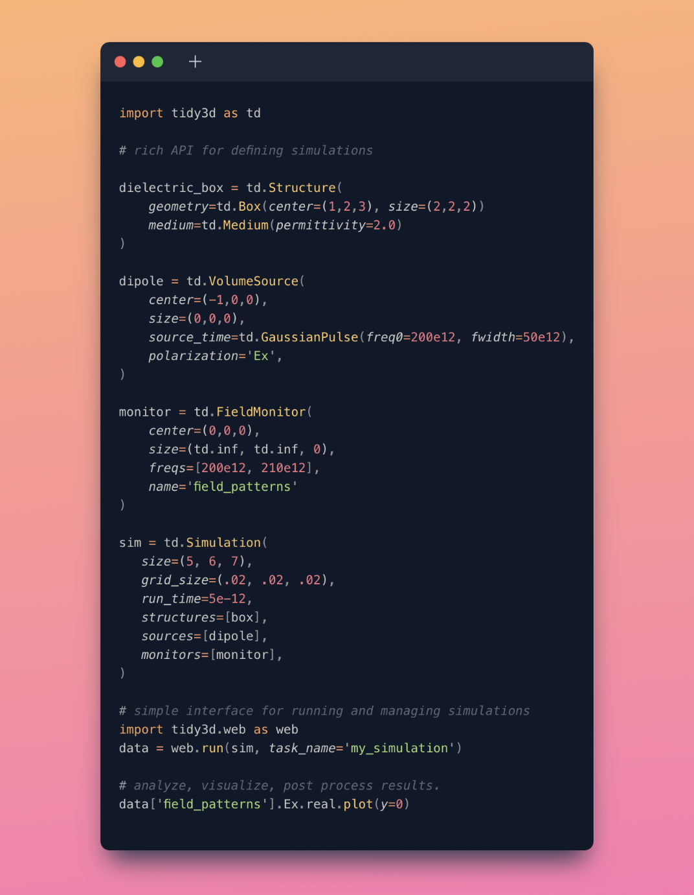

# Tidy3D (Beta release)


<!-- [](https://mybinder.org/v2/gh/flexcompute/Tidy3D-client-revamp/HEAD?filepath=notebooks) -->

Beta release of the FDTD solver by Flexcompute.



## Installation

For now:

```
git clone https://github.com/flexcompute/tidy3d.git
cd tidy3d
pip install -e .
```

Can verify it worked by running

```
python -c "import tidy3d as td; print(td.__version__)"
```

and it should print out 

```
0.2.0
```

After we put on pyPI, it will be installable via

```
pip install tidy3d-beta
```

but the package will still be imported in python as 

```python
import tidy3d as td
```
