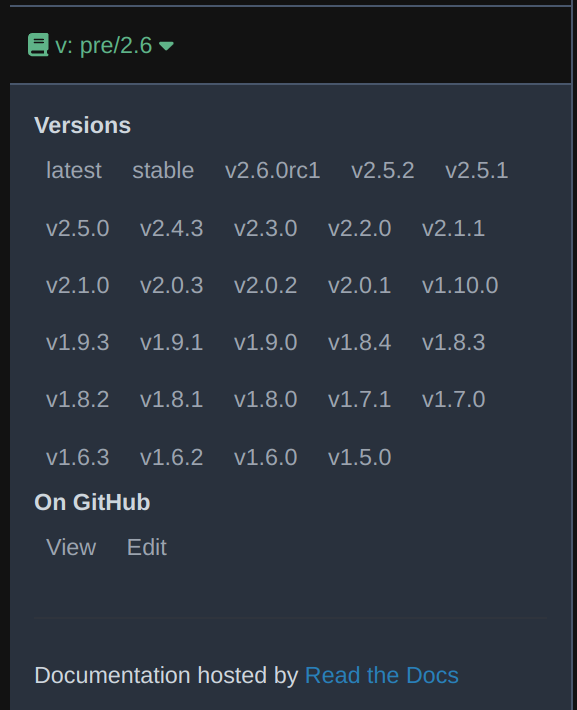

********************
Changelog |:rewind:|
********************

Documentation Versions
######################

You can find the documentation for all the supported versions of ``tidy3d`` within this website.
To switch between versions, use the version selector in the bottom left corner of the page as per the image below.
The version selector is only available on the main page of the documentation.

After version ``>=2.6``, the documentation was restructured so old internal documentation links will not match to the
new internal documentation page links. To access the new documentation, we recommend navigating to the `main page <../>`_ and switching versions from there before navigating to the page.

Version Release Notes
#######################

.. include:: ../CHANGELOG.md
   :parser: myst_parser.sphinx_
