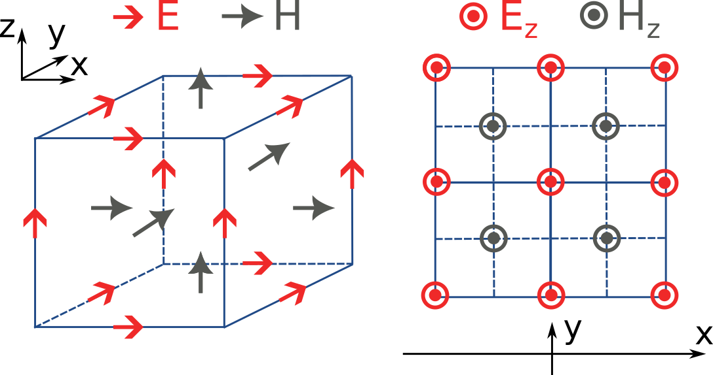
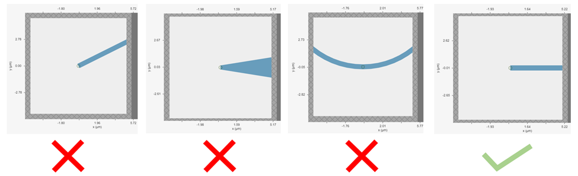
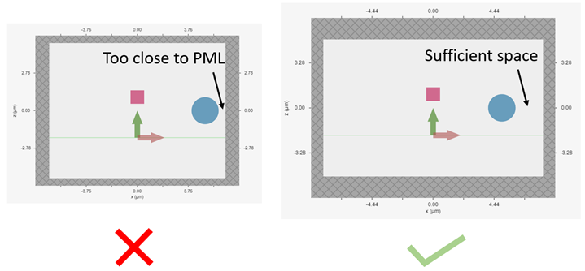

FAQ
==========================

What is Tidy3D?
---------------

Tidy3D is Flexcompute's ultrafast electromagnetic (EM) solver. The solver is based on the finite-difference time-domain (FDTD) method. Thanks to the highly optimized co-design of software and hardware, Tidy3D runs simulations orders of magnitude faster than other EM solvers on the market. With the lightning fast speed, you can also solve problems hundreds of wavelength in size, which is often not feasible with conventional approaches.

How can I install the Python client of Tidy3d?
----------------------------------------------

We recommend using the Conda package management system to manage your Python virtual environment as well as installing Tidy3D. To avoid package version incapability issues, we recommend creating a new Conda environment and install Tidy3D via pip. Please follow the detailed installation instructions `here <https://docs.flexcompute.com/projects/tidy3d/en/stable/install.html/>`_. If you encounter any issues during installation, please reach out to us and we will provide the necessary help to you in a timely manner.

Can I do a free trial to evaluate the capabilities of Tidy3D before purchasing it?
----------------------------------------------------------------------------------

Yes. If you are new to Tidy3D and would like to experience the ultrafast electromagnetic simulations, you can apply for a free trial which allows you to test a good number of small to medium sized simulations. The goal of the free trial is to get you familiarized with Tidy3D and evaluate its capabilities on your project. During the trial period, we provide full technical support to answer any questions you might have about using Tidy3D.

Can I get a discount as a student or teacher?
---------------------------------------------

Yes, we offer special pricing for graduate students, postdocs, and faculties of eligible universities. Go to your `Educational Programs <https://www.flexcompute.com/tidy3d/educational-programs/>`_ to apply.

What are the advantages of Tidy3D compared to traditional EM simulators?
------------------------------------------------------------------------

There are several unique advantages that set Tidy3D apart from other tradition EM simulators.
First of all, Tidy3D provides cloud-based simulation services. Our users do not need to purchase nor manage their own dedicated computer hardware, which is a great time and cost saving.
Secondly, Tidy3D utilizes a proprietary co-design of software and hardware. The end result is the lightning fast simulation speed and scalability. Compared to traditional CPU-based EM simulators, Tidy3D is orders of magnitude faster, which enables short R&D design cycle.
Lastly, Tidy3D not only has a feature-rich web GUI, but also fully embraces the flexible Python environment. Our users can construct simulations either using the GUI or Python scripts.

How do I run a simulation and access the results?
-------------------------------------------------

Submitting and monitoring jobs, and donwloading the results, is all done 
through our `web API <api.html#web-api/>`_. After a successful run, 
all data for all monitors can be downloaded in a single ``.hdf5`` file 
using :meth:`tidy3d.web.webapi.load`, and the
raw data can be loaded into a :class:`.SimulationData` object.

From the :class:`.SimulationData` object, one can grab and plot the data for each monitor with square bracket indexing, inspect the original :class:`.Simulation` object, and view the log from the solver run.  For more details, see `this tutorial <notebooks/VizSimulation.html/>`_.

How is using Tidy3D billed?
---------------------------

The `Tidy3D client <https://pypi.org/project/tidy3d/>`_ that is used for designing 
simulations and analyzing the results is free and 
open source. We only bill the run time of the solver on our server, taking only the compute 
time into account (as opposed to overhead e.g. during uploading).
When a task is uploaded to our servers, we will print the maximum incurred cost in FlexCredit.
This cost is also displayed in the online interface for that task.
This value is determined by the cost associated with simulating the entire time stepping specified.
If early shutoff is detected and the simulation completes before the full time stepping period, this
cost will be pro-rated.
For more questions or to purchase FlexCredit, please contact us at ``support@flexcompute.com``.

Do I have to know Python programming to use Tidy3D?
---------------------------------------------------

Tidy3D simulations can be defined in two ways: our web GUI or Python scripts. If you do not have Python programming 
experience, you can use our feature-rich web GUI to define simulation, submit simulation, and visualize simulation 
results.
Since defining simulation and performing post-processing in Python offers additional flexibity, we do 
recomment our users to learn to use Python, especially for more complex simulations. There are a lot of great free 
resources for learning Python online. You can also reference our Python API documentation as well as a variety of 
examples in our `Learning Center <https://www.flexcompute.com/tidy3d/learning-center/>`_.

How to submit a simulation in Python to the server?
---------------------------------------------------

Submitting a simulation to our cloud server is very easily done by a simple web API call. First define a job by

.. code-block:: python

  job = web.Job(simulation, task_name)

Then submit the job by using the :meth:`.run` method as

.. code-block:: python

  sim_data = job.run(path)

After the simulation is complete, result data will be automatically returned to ``sim_data``.

What are the units used in the simulation?
------------------------------------------

We generally assume the following physical units in component definitions:

 - Length: micron (μm, 10\ :sup:`-6` meters)
 - Time: Second (s)
 - Frequency: Hertz (Hz)
 - Electric conductivity: Siemens per micron (S/μm)

Thus, the user should be careful, for example to use the speed of light 
in μm/s when converting between wavelength and frequency. The built-in 
speed of light :py:obj:`.C_0` has a unit of μm/s. 

For example:

.. code-block:: python

    wavelength_um = 1.55
    freq_Hz = td.C_0 / wavelength_um
    wavelength_um = td.C_0 / freq_Hz

Currently, only linear evolution is supported, and so the output fields have an 
arbitrary normalization proportional to the amplitude of the current sources, 
which is also in arbitrary units. In the API Reference, the units are explicitly 
stated where applicable. 

Output quantities are also returned in physical units, with the same base units as above. For time-domain outputs
as well as frequency-domain outputs when the source spectrum is normalized out (default), the following units are
used:

 - Electric field: Volt per micron (V/μm)
 - Magnetic field: Ampere per micron (A/μm)
 - Flux: Watt (W)
 - Poynting vector: Watt per micron squared (W/μm\ :sup:`2`)
 - Modal amplitude: Sqare root of watt (W\ :sup:`1/2`)

If the source normalization is not applied, the electric field, magnetic field, and modal amplitudes are divided by
Hz, while the flux and Poynting vector are divided by Hz\ :sup:`2`.

How are results normalized?
---------------------------

In many cases, Tidy3D simulations can be run and well-normalized results can be obtained without normalizing/empty runs.
This is because care is taken internally to normalize the injected power, as well as the output results, in a
meaningful way. To understand this, there are two separate normalizations that happen, outlined below. Both of those are
discussed with respect to frequency-domain results, as those are the most commonly used.

Source spectrum normalization
^^^^^^^^^^^^^^^^^^^^^^^^^^^^^

Every source has a spectrum associated to its particular time dependence that is imprinted on the fields injected
in the simulation. Usually, this is somewhat arbitrary and it is most convenient for it to be taken out of the
frequency-domain results. By default, after a run, Tidy3D normalizes all frequency-domain results by the spectrum of the first source
in the list of sources in the simulation. This choice can be modified using the :py:obj:`.Simulation.normalize_index` attribute, or
normalization can be turned off by setting that to ``None``. Results can even be renoramlized after the simulation run using
:meth:`.SimulationData.renormalize`. If multiple sources are used, but they all have the same
time dependence, the default normalization is still meaningful. However, if different sources have a different time dependence,
then it may not be possible to obtain well-normalized results without a normalizing run.

This type of normalization is applied directly to the frequency-domain results. The custom pulse amplitude and phase defined in
:py:obj:`.SourceTime.amplitude` and :py:obj:`.SourceTime.phase`, respectively, are **not** normalized out. This gives the user control
over a (complex) prefactor that can be applied to scale any source.
Additionally, the power injected by each type of source may have some special normalization, as outlined below.

Source power normalization
^^^^^^^^^^^^^^^^^^^^^^^^^^

Source power normalization is applied depending on the source type. In the cases where normalization is applied,
the actual injected power may differ slightly from what is described below due to finite grid effects. The normalization
should become exact with sufficiently high resolution. That said, in most cases the error is negligible even at default resolution.

The injected power values described below assume that the source spectrum normalization has also been applied.

- :class:`.PointDipole`: Normalization is such that the power injected by the source in a homogeneous material of
  refractive index :math:`n` at frequency :math:`\omega = 2\pi f` is given by

  .. math::
      \frac{\omega^2}{12\pi}\frac{\mu_0 n}{c}.

- :class:`.UniformCurrentSource`: No extra normalization applied.
- :class:`.CustomFieldSource`: No extra normalization applied.
- :class:`.ModeSource`, :class:`.PlaneWave`, :class:`.GaussianBeam`, :class:`.AstigmaticGaussianBeam`:
  Normalized to inject 1W power at every frequency. If supplied :py:obj:`.SourceTime.num_freqs` is ``1``, this normalization is
  only exact at the central frequency of the associated :class:`.SourceTime` pulse, but should still be
  very close to 1W at nearby frequencies too. Increasing ``num_freqs`` can be used to make sure the normalization
  works well for a broadband source.

  The correct usage for a :class:`.PlaneWave` source is to span the whole simulation domain for a simulation with
  periodic (or Bloch) boundaries, in which
  case the normalization of this technically infinite source is equivalent to 1W per unit cell. For the other sources
  which have a finite extent, the normalization is correct provided that the source profile decays by the boundaries
  of the source plane. Verifying that this is the case is always advised, as otherwise results may be spurious
  beyond just the normalization (numerical artifacts will be present at the source boundary).
- :class:`.TFSFSource`: Normalized to inject 1W/μm\ :sup:`2` in the direction of the source injection axis. This is convenient
  for computing scattering and absorption cross sections without the need for additional normalization. Note that for angled incidence,
  a factor of :math:`1/\cos(\theta)` needs to be applied to convert to the power carried by the plane wave in the propagation direction,
  which is at an angle :math:`\theta` with respect to the injection axis. Note also that when the source spans the entire simulation
  domain with periodic or Bloch boundaries, the conversion between the normalization of a :class:`.TFSFSource` and a :class:`.PlaneWave`
  is just the area of the simulation domain in the plane normal to the injection axis.

What source bandwidth should I use for my simulation?
-----------------------------------------------------

Tidy3D's broadband source feature is designed to produce the most accurate results in the frequency 
range of ``(freq0 - 1.5 * fwidth, freq0 + 1.5 * fwidth)``. Therefore, it is necessary to define the source center 
frequency ``freq0`` and bandwidth ``fwidth`` to properly cover the desired application frequency range. For example, 
if the user wants to adjust the source bandwidth to cover a wavelength range between ``wl_min`` and ``wl_max``, 
the source bandwidth can be defined as: ``fwidth = alpha * (C_0/wl_max - C_0/wl_min)``, where ``alpha`` is a constant 
typically chosen between 1/3 and 1/2 to ensure accurate results.

How do I include material dispersion?
-------------------------------------

Dispersive materials are supported in Tidy3D and we provide an extensive 
`material library <api.html#material-library>`_ with pre-defined materials. 
Standard `dispersive material models <api.html#dispersive-mediums/>`_ can also be defined. 
If you need help inputting a custom material, let us know!

It is important to keep in mind that dispersive materials are inevitably slower to 
simulate than their dispersion-less counterparts, with complexity increasing with the 
number of poles included in the dispersion model. For simulations with a narrow range 
of frequencies of interest, it may sometimes be faster to define the material through 
its real and imaginary refractive index at the center frequency. This can be done by 
defining directly a value for the real part of the relative permittivity 
:math:`\mathrm{Re}(\epsilon_r)` and electric conductivity :math:`\sigma` of a :class:`.Medium`, 
or through a real part :math:`n` and imaginary part :math:`k`of the refractive index at a 
given frequency :math:`f`. The relationship between the two equivalent models is 

.. math::

    &\mathrm{Re}(\epsilon_r) = n^2 - k^2 

    &\mathrm{Im}(\epsilon_r) = 2nk

    &\sigma = 2 \pi f \epsilon_0 \mathrm{Im}(\epsilon_r)

In the case of (almost) lossless dielectrics, the dispersion could be negligible in a broad 
frequency window, but generally, it is importat to keep in mind that such a 
material definition is best suited for single-frequency results.

For lossless, weakly dispersive materials, the best way to incorporate the dispersion 
without doing complicated fits and without slowing the simulation down significantly is to 
provide the value of the refractive index dispersion :math:`\mathrm{d}n/\mathrm{d}\lambda` 
in :meth:`.Sellmeier.from_dispersion`. The value is assumed to be 
at the central frequency or wavelength (whichever is provided), and a one-pole model for the 
material is generated. These values are for example readily available from the 
`refractive index database <https://refractiveindex.info/>`_.

Can I import my own tabulated material data?
--------------------------------------------

Yes, users can import their own tabulated material data and fit it using one of Tidy3D's dispersion 
fitting tools. The :class:`.FastDispersionFitter` tool 
performs an optimization to find a medium defined as a dispersive PoleResidue model that minimizes the RMS error 
between the model results and the data. The user can provide data through one of the following methods:

- Numpy arrays directly by specifying ``wvl_um``, ``n_data``, and optionally ``k_data``.
- A data file with the :meth:`from_file` utility function. The data file has columns for wavelength (:math:`\mu`m), 
the real part of the refractive index (:math:`n`), and the imaginary part of the refractive index (:math:`k`). :math:`k` data is optional. 
Note: :meth:`from_file` uses ``np.loadtxt`` under the hood, so additional keyword arguments for parsing the file 
follow the same format as ``np.loadtxt``.
- URL link to a CSV/TXT file that contains wavelength (:math:`\mu`m), :math:`n`, and optionally :math:`k` data with the :meth:`from_url` utility 
function. URL can come from `refractiveindex <https://refractiveindex.info/>`_. 

We also have the :class:`.DispersionFitter` webservice which uses global optimization algorithms to find stable dispersion fits. 
This webservice may work if the :class:`.FastDispersionFitter` does not find an adequate fit. 
Note however that the :class:`.FastDispersionFitter` also produces stable material fits.
The :class:`.DispersionFitter` tool implements our proprietary stability criterion. 
The dispersion fitter webservice is setup using the :class:`.DispersionFitter` and :class:`.AdvancedFitterParam` classes, 
and run using :meth:`dispersion.web.run` to obtain stable material fits. This interface replaces the deprecated 
``StableDispersionFitter`` class.
This `notebook <https://docs.flexcompute.com/projects/tidy3d/en/stable/notebooks/Fitting.html/>`_ provides detailed 
instructions and examples of using both :class:`.DispersionFitter` 
and :class:`.FastDispersionFitter` to create 
customized materials based on refractive index tabulated data.

Why did my simulation finish early?
-----------------------------------

By default, Tidy3D checks periodically the total field intensity left in the simulation, and compares
that to the maximum total field intensity recorded at previous times. If it is found that the ratio
of these two values is smaller than 10\ :sup:`-5`, the simulation is terminated as the fields remaining
in the simulation are deemed negligible. The shutoff value can be controlled using the :py:obj:`.Simulation.shutoff`
parameter, or completely turned off by setting it to zero. In most cases, the default behavior ensures
that results are correct, while avoiding unnecessarily long run times. The Flex Unit cost of the simulation
is also proportionally scaled down when early termination is encountered.

Should I make sure that fields have fully decayed by the end of the simulation?
-------------------------------------------------------------------------------

Conversely to early termination, you may sometimes get a warning that the fields remaining in the simulation
at the end of the run have not decayed down to the pre-defined shutoff value. This should **usually** be avoided
(that is to say, :py:obj:`.Simulation.run_time` should be increased), but there are some cases in which it may
be inevitable. The important thing to understand is that in such simulations, frequency-domain results cannot
always be trusted. The frequency-domain response obtained in the FDTD simulation only accurately represents
the continuous-wave response of the system if the fields at the beginning and at the end of the time stepping are (very close to) zero.
That said, there could be non-negligible fields in the simulation yet the data recorded in a given monitor
can still be accurate, if the leftover fields will no longer be passing through the monitor volume. From the
point of view of that monitor, fields have already fully decayed. However, there is no way to automatically check this.
The accuracy of frequency-domain monitors when fields have not fully decayed is also discussed in one of our
`FDTD 101 videos <https://www.flexcompute.com/fdtd101/Lecture-3-Applying-FDTD-to-Photonic-Crystal-Slab-Simulation/>`_.

The main use case in which you may want to ignore this warning is when you have high-Q modes in your simulation that would require
an extremely long run time to decay. In that case, you can use the the :class:`.ResonanceFinder` plugin to analyze the modes,
as well as field monitors with apodization to capture the modal profiles. The only thing to note is that the normalization of
these modal profiles would be arbitrary, and would depend on the exact run time and apodization definition. An example of
such a use case is presented in our high-Q photonic crystal cavity `case study <notebooks/OptimizedL3.html/>`_.

Why can I not change Tidy3D instances after they are created?
-------------------------------------------------------------

You may notice in Tidy3D versions 1.5 and above that it is no longer possible to modify instances of Tidy3D components after they are created.
Making Tidy3D components immutable like this was an intentional design decision intended to make Tidy3D safer and more performant.

For example, Tidy3D contains several "validators" on input data.
If models are mutated, we can't always guarantee that the resulting instance will still satisfy our validations and the simulation may be invalid.

Furthermore, making the objects immutable allows us to cache the results of many expensive operations.
For example, we can now compute and store the simulation grid once, without needing to worry about the value becoming stale at a later time, which significantly speeds up plotting and other operations.

If you have a Tidy3D component that you want to recreate with a new set of parameters, instead of ``obj.param1 = param1_new``, you can call ``obj_new = obj.copy(update=dict(param1=param1_new))``.
Note that you may also pass more key value pairs to the dictionary in ``update``.
Also, note you can use a convenience method ``obj_new = obj.updated_copy(param1=param1_new)``, which is just a shortcut to the ``obj.copy()`` call above.

What do I need to know about the numerical grid?
------------------------------------------------

Tidy3D tries to provide an illusion of continuity as much as possible, but at the level of the solver a finite numerical grid is used, which
can have some implications that advanced users may want to be aware of.

The FDTD method for electromagnetic simulations uses what's called the Yee grid, in which every field component is defined at a different spatial location, as illustrated in the figure, as well as in our FDTD video tutorial `FDTD 101 videos <https://www.flexcompute.com/fdtd101/Lecture-1-Introduction-to-FDTD-Simulation/>`_. On the left, we show one cell of the full 3D Yee grid, and where the various ``E`` and ``H`` field components live. On the right, we show a cross-section in the xy plane, and the locations of the ``Ez`` and ``Hz`` field components in that plane (note that these field components are not in the same cross-section along ``z`` but rather also offset by half a cell size). This illustrates a duality between the grids on which ``E`` and ``H`` fields live, which is related to the duality between the fields themselves. There is a primal grid, shown with solid lines, and a dual grid, shown with dashed lines, with the ``Ez`` and ``Hz`` fields living at the primal/dual vertices in the ``xy``-palne, respectively. In some literature on the FDTD method, the primal and dual grids may even be switched as the definitions are interchangeable. In Tidy3D, the primal grid is as defined by the solid lines in the Figure.

When computing results that involve multiple field components, like Poynting vector, flux, or total field intensity, it is important to use fields that are defined at the
same locations, for best numerical accuracy. The field components thus need to be interpolated, or colocated, to some common coordinates. All this is already done under the
hood when using Tidy3D in-built methods to compute such quantities. When using field data directly, Tidy3D provides several conveniences to handle this. Firstly, field monitors have a ``colocate`` option, set to ``True`` by default, which will automatically return the field data interpolated to the primal grid vertices. The data is then ready to be used directly for computing quantities derived from any combination of the field components. The ``colocate`` option can be turned off by advanced users, in which case each field component will have different coordinates as defined by the Yee grid. In some cases, this can lead to more accurate results, as discussed for example in the `custom source example <notebooks/CustomFieldSource.html/>`_. In that example, when using data generated by one simulation as a source in another, it is best to use the fields as recorded on the Yee grid.

Regardless of whether the ``colocate`` option is on or off for a given monitor, the data can also be easily colocated after the solver run. In principle, if colocating to locations other than the primal grid in post-processing, it is more accurate to set ``colocate=False`` in the monitor to avoid double interpolation (first to the primal grid in the solver, then to new locations). Regardless, the following methods work for both Yee grid data and data that has already been previously colocated:

- ``data_at_boundaries = sim_data.at_boundaries(monitor_name)`` to colocate all fields of a monitor to the Yee grid cell boundaries (i.e. the primal grid vertexes).
- ``data_at_centers = sim_data.at_centers(monitor_name)`` to colocate all fields of a monitor to the Yee grid cell centers (i.e. the dual grid vertexes).
- ``data_at_coords = sim_data[monitor_name].colocate(x=x_points, y=y_points, z=z_points)`` to colocate all fields to a custom set of coordinates. Any or all of ``x``, ``y``, and ``z`` can be supplied; if some are not, the original data coordinates are kept along that dimension.

How fine of a grid or mesh does my simulation need? How to choose grid spec?
----------------------------------------------------------------------------

The FDTD and other similar numerical methods will always give approximate results for a set of finite-difference equations. 
The accuracy of Maxwell's equations solution for any geometry can be arbitrarily increased by using smaller 
and smaller values of the space and time increments. This strategy often involves increased simulation time and memory, 
so it is essential to consider, for your application, what is the desired accuracy in results so that you can run 
your simulations as quickly as possible. As a gold rule of thumb, ten grid points per wavelength in the highest refractive 
index medium should be a good starting value for the grid resolution. However, other application specificities must be 
considered when defining the appropriate simulation mesh, such as very thin geometries or large electric field gradients, 
as usually occurs, for example, in the presence of resonances, highly confined fields, or at metal-dielectric interfaces.

Tidy3D has many features to give the user a simple and flexible way to build the simulation mesh. 
The :class:`.GridSpec` object enables the user to chose between 
an :class:`.AutoGrid`, a :class:`.UniformGrid`, or a :class:`.CustomGrid`, at each of the simulation 
``x``-, ``y``-, ``z``-direction. An example code snippet is shown below:

.. code-block:: python

  uniform = td.UniformGrid(dl=0.1)
  custom = td.CustomGrid(dl=[0.2, 0.2, 0.1, 0.1, 0.1, 0.2, 0.2])
  auto = td.AutoGrid(min_steps_per_wvl=12)
  grid_spec = td.GridSpec(grid_x=uniform, grid_y=custom, grid_z=auto, wavelength=1.5)

More examples of setting up the simulation mesh are available on this `notebook <https://www.flexcompute.com/tidy3d/examples/notebooks/AutoGrid/>`_.

In general, a good strategy is to start with the default object :class:`.AutoGrid` to discretize the whole 
simulation domain and fine-tune the mesh by increasing the grid resolution at directions or regions containing 
smallest geometric features or high field gradients or even relaxing the discretization along directions 
of invariant geometry, e.g., the propagation direction of channel waveguides. The definition of an override 
structure is an efficient way to improve simulation accuracy while keeping small the run time.

How to use the automatic nonuniform meshing? What steps per wavelength will be sufficient?
------------------------------------------------------------------------------------------

By default, Tidy3D configures the :class:`.GridSpec` object to having :class:`.AutoGrid`, which is an advanced meshing 
algorithm to automatically define a nonuniform grid, in all the three domain direction. The resolution of this grid 
is specified using the desired minimum steps per wavelength in each material (``min_steps_per_wvl = 10 by default``). 
This specification, therefore, requires a target wavelength, which can be either provided directly to :class:`.GridSpec` 
or inferred from any sources present in the simulation. Detailed examples on how to set up :class:`.AutoGrid` are 
present on this `notebook <https://www.flexcompute.com/tidy3d/examples/notebooks/AutoGrid/>`_.

As a gold rule of thumb, the default value of 10 grid points per wavelength should be a good starting 
value for :py:obj:`min_steps_per_wvl`. However, other application-specific features must be considered when defining 
the appropriate simulation mesh, such as very thin geometries or large electric field gradients, as can usually occur, 
for example, in the presence of resonances, highly confined fields, or at metal-dielectric interfaces. Additional control 
over the mesh is obtained by the :py:obj:`dl_min` parameter, which imposes a lower bound of the grid size regardless of 
the structures present in the simulation, including override structures with :py:obj:`enforced=True`. This is, however, 
a soft bound, meaning that the actual minimal grid size might be slightly smaller. Finally, the :py:obj:`max_scale` sets 
the maximum ratio between two consecutive grid steps. Different grid configurations can be chosen for each direction, 
as illustrated bellow:

.. code-block:: python

  grid_spec = td.GridSpec(
    grid_x=td.AutoGrid(min_steps_per_wvl=20, dl_min=0.01),
    grid_y=td.AutoGrid(min_steps_per_wvl=15),
    grid_z=td.AutoGrid(min_steps_per_wvl=10, max_scale=1.6),
    wavelength=1.0,
  )

How to run a 2D simulation in Tidy3D?
-------------------------------------

To run 2D simulations in Tidy3D, set the simulation size in one dimension 
to 0 (``td.Simulation(size=[size_x, size_y, 0])``). Additionally, specify a :class:`.Periodic` boundary 
condition in that direction. For an example of running a 2D simulation in Tidy3D, see this 2D ring resonator `notebook <https://www.flexcompute.com/tidy3d/examples/notebooks/RingResonator/>`_.

Can I have structures larger than the simulation domain?
--------------------------------------------------------

Structures can indeed be larger than the simulation domain in Tidy3D. In such cases, Tidy3D will automatically 
truncate the geometry that goes beyond the domain boundaries. For best results, structures that intersect with 
absorbing boundaries or simulation edges should extend all the way through. In many such cases, an "infinite" 
size ``td.inf`` can be used to define the size along that dimension.

Why is a simulation diverging?
------------------------------

Sometimes, a simulation is numerically unstable and can result in divergence. All known cases where
this may happen are related to PML boundaries and/or dispersive media. Below is a checklist of things
to consider.

- For dispersive materials with :math:`\varepsilon_{\infty} < 1`, decrease the value of the Courant stability factor to
  below :math:`\sqrt{\varepsilon_{\infty}}`.
- Move PML boundaries further away from structure interfaces inside the simulation domain, or from sources that may be injecting
  evanescent waves, like :class:`.PointDipole`, :class:`.UniformCurrentSource`, or :class:`.CustomFieldSource`.
- Make sure structures are translationally invariant into the PML, or if not possible, use :class:`.Absorber` boundaries.
- Remove dispersive materials extending into the PML, or if not possible, use :class:`.Absorber` boundaries.
- If using our fitter to fit your own material data, use the server side :class:`.plugins.dispersion.DispersionFitter` plugin if results from :class:`.plugins.dispersion.FastDispersionFitter` are not satisfactory.
- If none of the above work, try using :class:`.StablePML` or :class:`.Absorber` boundaries anyway
  (note: these may introduce more reflections than in usual simulations with regular PML).

How to troubleshoot a diverged FDTD simulation
----------------------------------------------

Tidy3D uses the Finite-Difference Time-Domain (FDTD) method, which is a popular technique for rigorously solving 
Maxwell's equations. However, like all numerical methods, it can sometimes diverge if not properly set up. An FDTD 
simulation can diverge due to various reasons. In this article, we discuss common FDTD setting issues that could 
potentially lead to simulation divergence. If your simulation diverged, please follow this article and perform 
thorough troubleshooting, which will likely resolve the issue and ensure that your next FDTD run is stable.

Structures Inserted into PML at an Angle
^^^^^^^^^^^^^^^^^^^^^^^^^^^^^^^^^^^^^^^^

Perfectly matched layer (PML) is the most commonly used boundary condition in FDTD simulations to truncate a simulation 
domain and absorb outgoing radiation. However, many divergence issues are associated with the use of PML. One of the 
most common causes of a diverged simulation is structures inserted into PML at an angle. This is particularly common 
in simulations with photonic waveguides, where PML intersects a waveguide bend or a waveguide taper. To ensure 
numerical stability, you need to make sure that structures are translationally invariant into the PML.

It is not always practically possible to have structures translationally invariant into PML. For example, in a 
waveguide-to-ring coupling simulation, part of the ring will have to intersect PML. In this case, using Tidy3D's 
adiabatic absorber boundary condition instead of PML is a good remedy. The absorber functions similarly to PML such 
that it absorbs the outgoing radiation to mimic the infinite space. However, the absorber has a slightly higher 
reflection and requires a bit more computation than PML but it is numerically much more stable. For the demonstration, 
please refer to the waveguide-to-ring coupling tutorial.

In principle, you can manually extend the bent waveguide or ring into PML in a translational invariant way. This 
could be effective in preventing divergence but the artificial kink will inevitably lead to undesired reflection. In 
general, we recommend using the absorber boundary rather than this approach.

Dispersive Material into PML
^^^^^^^^^^^^^^^^^^^^^^^^^^^^

Incorporating a dispersive material into PML can also cause simulation divergence in certain scenarios. If your 
simulation lacks any structures inserted into PML at an angle but includes dispersive material in PML, it is advisable 
to substitute nondispersive material for the dispersive material. Alternatively, if dispersion is necessary, switching 
PML to absorber can effectively address the issue.

Evanescent Field Leaks into PML
^^^^^^^^^^^^^^^^^^^^^^^^^^^^^^^

PML can effectively absorb outgoing radiation with minimum reflection as if the radiation just propagates into the 
free space. However, it's important to keep in mind that PML only absorbs propagating fields. For evanescent fields, 
PML can act as an amplification medium and cause a simulation to diverge. In Tidy3D, a warning will appear if the 
distance between a structure is smaller than half of a wavelength to prevent evanescent fields from leaking 
into PML. In most cases, the evanescent field will naturally die off within half a wavelength, but in some instances, 
a larger distance may be required. One example is when using periodic or Bloch boundary conditions in two dimensions 
and PML in the last dimension only. In such simulations, there could be quasi-guided modes in the periodic directions 
which have very long evanescent tails in the PML direction. If a simulation diverges and you suspect that evanescent 
fields may be leaking into PML, simply increase the simulation domain size to avoid this issue.

Additionally, sources like :class:`.PointDipole`, :class:`.UniformCurrentSource`, or :class:`.CustomFieldSource` can inject evanescent fields, 
so it's important to leave enough space between them and PML.

Gain Medium from Fitting
^^^^^^^^^^^^^^^^^^^^^^^^

When defining a dispersive material using an external fitter or Tidy3D's regular fitter, it is crucial to ensure 
that the fit is passive. Although the material may appear passive within the simulation frequency range, the 
fitting process could result in a gain medium outside of the frequency range, leading to simulation divergence. To 
avoid this, Tidy3D offers a stable dispersive fitter that enforces passive fitting across all frequencies. It is 
highly recommended to use this fitter for dispersive medium fitting.

Courant Factor is Too Large
^^^^^^^^^^^^^^^^^^^^^^^^^^^

When conducting FDTD simulations, it's important to satisfy the Courant factor condition. This condition, also 
known as the Courant number or Courant-Friedrichs-Lewy (CFL) condition, is a numerical requirement that relates 
the time step (:math:`\Delta t`) to the spatial step (:math:`\Delta x`), and sometimes to the wave propagation speed (:math:`c`) in the system. The 
Courant factor can be determined by the formula: :math:`C = c \times \Delta t / \Delta x`. To ensure the stability of 
the numerical solution, the Courant factor must be equal to or less than 1, according to the CFL 
condition: :math:`C \le 1`. By satisfying this condition, the simulation can accurately capture the wave propagation 
in the system, as information cannot travel further than one spatial step in one time step. Violating the CFL 
condition can cause the simulation to diverge and become unstable. Therefore, it's crucial to choose appropriate 
time and spatial step sizes for any FDTD simulation.

Tidy3D uses a default Courant factor of 0.99. When a dispersive material with :math:`\varepsilon_{\infty} < 1` is used, the Courant factor 
will be automatically adjusted to be smaller than :math:`\sqrt{\varepsilon_{\infty}}` to ensure stability. If your simulation still 
diverges despite addressing any other issues discussed above, reducing the Courant factor may help.

Additional Notes on Absorber
^^^^^^^^^^^^^^^^^^^^^^^^^^^^

As discussed above, using absorber boundary is often a good remedy to resolve divergence issues related to PML. The 
adiabatic absorber is a multilayer system with gradually increasing conductivity. As briefly discussed above, the 
absorber usually has a larger undesired reflection compared to PML. In practice, this small difference rarely matters, 
but is important to understand for simulations that require high accuracy. There are two possible sources for the 
reflection from absorbers. The first, and more common one, is that the ramping up of the conductivity is not 
sufficiently slow, which can be remedied by increasing the number of absorber layers (40 by default). The second one 
is that the absorption is not high enough, such that the light reaches the PEC boundary at the end of the Absorber, 
travels back through it, and is still not fully attenuated before re-entering the simulation region. If this is the 
case, increasing the maximum conductivity (see the API reference) can help. In both cases, changing the order of the 
scaling of the conductivity (sigma_order) can also have an effect, but this is a more advanced setting that we 
typically do not recommend modifying.

Contact Tidy3D Support
^^^^^^^^^^^^^^^^^^^^^^

If the solutions provided in this article did not resolve your simulation issues, please 
contact `Tidy3D Support <https://www.flexcompute.com/tidy3d/technical-support/>`_. Our experienced support engineers 
will assist you in resolving the problems with your simulation settings.