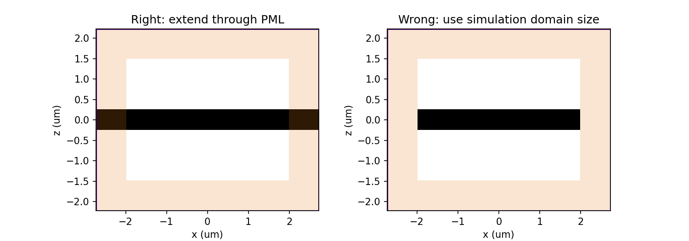

Frequently Asked Questions
==========================

How do I run a simulation and access the results?
-------------------------------------------------

Submitting and monitoring jobs, and donwloading the results, is all done 
through our `web API <api.html#web-api>`_. After a successful run, 
all data for all monitors can be downloaded in a single file 
``monitor_data.hdf5`` using :meth:`tidy3d.web.download_results`, and the 
raw data can be loaded and analyzed directly e.g. using `h5py <https://docs.h5py.org/en/stable/>`_. The data 
for each monitor is stored in a separate group, with the following datasets:

- ``E``: E-field, if requested upon monitor initialization (default).
- ``H``: H-field, if requested upon monitor initialization (default). 
- ``xmesh``: Mesh along ``x`` over which the fields were stored.
- ``ymesh``: Mesh along ``y`` over which the fields were stored.
- ``zmesh``: Mesh along ``z`` over which the fields were stored.
- (for a :class:`.TimeMonitor`) ``tmesh``: Mesh in time over which the fields were stored.
- (for a :class:`.FreqMonitor`) ``freqs``: List of frequencies over which the DFT was computed.

Each of ``E`` and ``H`` that was requested has the shape ``(3, Nx, Ny, Nz, Np)``, 
where ``Np`` is either the number of time steps or the number of frequencies. Note 
that the fields are interpolated to the center of the Yee grid cell.

The data file can also be loaded into the corresponding :class:`.Simulation` 
object that was used for the run using :meth:`.Simulation.load_results`. The Simulation 
object stores a list of all included monitors as :attr:`.Simulation.monitors`, and the data 
can be queried using :meth:`.Simulation.data`. Loading the results in this way also allows 
you to use our in-built `visualization <api.html#plotting-tools>`_ functions.

How is using Tidy3D billed?
---------------------------

The `Tidy3D client <https://pypi.org/project/tidy3d/>`_ that is used for designing 
simulations and analyzing the results is free and 
open source. We only bill the run time of the solver on our server, taking only the compute 
time into account (as opposed to overhead e.g. during uploading). In the online user interface, 
we provide an estimate of the billed amount a simulation would incur, but the final value is 
determined by timing the actual run. If you notice a significant difference between the estimate 
and the final value, please let us know!

What are the units used in the simulation?
------------------------------------------

We assume the following physical units:

  - Length: micron (μm, :math:`10^{-6}` meters)
  - Time: Second (s)
  - Frequency: Hertz (Hz)
  - Electric conductivity: Siemens per micron (S/μm)

Thus, the user should be careful, for example to use the speed of light 
in μm/s when converting between wavelength and frequency. The built-in 
speed of light ``td.constants.C_0`` has a unit of μm/s. 

For example:

.. code-block:: python

    freq_Hz = td.constants.C_0 / wavelength_um
    wavelength_um = td.constants.C_0 / freq_Hz

Currently, only linear evolution is supported, and so the output fields have an 
arbitrary normalization proportional to the amplitude of the current sources, 
which is also in arbitrary units. In the API Reference, the units are explicitly 
stated where applicable. 

How do I add PML absorbing boundaries to my simulation?
-------------------------------------------------------

Upon initializing a simulation, the user can provide an optional argument ``pml_layers``, 
an array of three elements defining the PML boundaries along x, y, and z. The 
easiest way to define PML is to use e.g. ``pml_layers=(None, None, 'standard')`` 
to define PML in the z-direction only (in x and y, the default periodic boundaries will 
be used). It is also possible to customize the PML further as explained in the 
`documentation <generated/tidy3d.Simulation.html>`_ and below.

Tidy3D uses a complex frequency-shifted formulation of the perfectly-matched layers (CPML), 
for which it is more natural to define the thickness as number of layers rather than as 
physical size. We provide two pre-set PML profiles, ``'standard'`` (default) and ``'stable'``. 
The standard profile has 12 layers by default and should be sufficient in many situations. In the 
case of a diverging simulation, or when the fields do not appear to be fully absorbed in the PML, 
the user can increase the number of layers in the ``'standard'`` profile, or try the ``'stable'`` 
profile, which requires more layers (default is 40) but should generally work better. 

**NB**: The PML layers extend **beyond** the simulation domain. This makes it easier not to worry 
about PMLs intruding into parts of your simulation where you don't want them to be. The one thing 
to keep in mind, however, is that structures that span the full simulation should also extend into 
the PML. So when defining such structures, it is best to extend them well beyond  
the simulation size. You could even use ``td.inf``, a shortcut for a very large value, for 
dimensions that span the full domain. Below is an example of a right and a wrong way to make a 
dielectric slab.

.. code-block:: python

    import tidy3d as td
    import matplotlib.pyplot as plt

    sim_size = [4., 4., 3.]
    pml_layers = [15, 15, 15]

    # Correct way: extend slab beyond simulation domain
    slab_right = td.Box(
        center=[0, 0, 0],
        size=[td.inf, td.inf, .5],
        material=td.Medium(epsilon=5))

    sim_right = td.Simulation(
        size=sim_size,
        resolution=20,
        structures=[slab_right],
        pml_layers=pml_layers)

    # Wrong: use simulation domain size when using PML
    slab_wrong = td.Box(
        center=[0, 0, 0],
        size=[sim_size[0], sim_size[1], .5],
        material=td.Medium(epsilon=5))

    sim_wrong = td.Simulation(
        size=sim_size,
        resolution=20,
        structures=[slab_wrong],
        pml_layers=pml_layers)

    fig, ax = plt.subplots(1, 2, figsize=(11, 4))
    sim_right.viz_eps_2D(normal='y', ax=ax[0])
    sim_wrong.viz_eps_2D(normal='y', ax=ax[1])
    ax[0].set_title('Right: extend through PML')
    ax[1].set_title('Wrong: use simulation domain size')
    plt.show()

Notice that the simulation size in ``y`` is defined as 4 micron on initialization, 
but the full simulation domain with the PML layers is 5.5 micron. A large number of PML 
layers can thus lead to a significant increase of computation time in some cases.

Why is a simulation diverging?
------------------------------

Sometimes, a simulation is numerically unstable and can result in divergence. The two 
things that can be tuned to avoid that are the thickness of the PML layers and the Courant 
stability factor, each of which are defined upon initializing a simulation. If materials with 
frequency-independent permittivity smaller than one are included in the simulation, the 
Courant factor must be set to a value lower than the lowest refractive index. In the case of 
dispersive materials, understanding the reason for the instability is a matter of trial and error. 
Some things to try include:

- Remove dispersive materials extending into the PML.
- Increase the number of PML layers.
- Decrease the value of the Courant stability factor. Note that this leads to an inversely 
  proportional increase in the simulation time.

How do I include material dispersion?
-------------------------------------

Dispersive materials are supported in Tidy3D and we provide an extensive 
`material library <generated/tidy3d.material_library.html>`_ with pre-defined materials. 
Standard `dispersive material models <api.html#dispersive-models>`_ can also be defined. 
If you need help inputting a custom material, let us know!

It is important to keep in mind that dispersive materials are inevitably slower to 
simulate than their dispersion-less counterparts, with complexity increasing with the 
number of poles included in the dispersion model. For simulations with a narrow range 
of frequencies of interest, it may sometimes be faster to define the material through 
its real and imaginary refractive index at the center frequency. This can be done by 
defining directly a value for the real part of the relative permittivity 
:math:`\mathrm{Re}(\epsilon_r)` and electric conductivity :math:`\sigma` of a :class:`.Medium`, 
or through a real part :math:`n` and imaginary part :math:`k`of the refractive index at a 
given frequency :math:`f`. The relationship between the two equivalent models is 

.. math::

    &\mathrm{Re}(\epsilon_r) = n^2 - k^2 

    &\mathrm{Im}(\epsilon_r) = 2nk

    &\sigma = 2 \pi f \epsilon_0 \mathrm{Im}(\epsilon_r)

In the case of (almost) lossless dielectrics, the dispersion could be negligible in a broad 
frequency window, but generally, it is importat to keep in mind that such a 
material definition is best suited for single-frequency results.

For lossless, weakly dispersive materials, the best way to incorporate the dispersion 
without doing complicated fits and without slowing the simulation down significantly is to 
include the value of the refractive index dispersion :math:`\mathrm{d}n/\mathrm{d}\lambda` 
in units of 1/micron when defining the :class:`.Medium`. The value is assumed to be 
at the central frequency or wavelength (whichever is provided), and a one-pole model for the 
material is generated. These values are for example readily available from the 
`refractive index database <https://refractiveindex.info/>`_.

