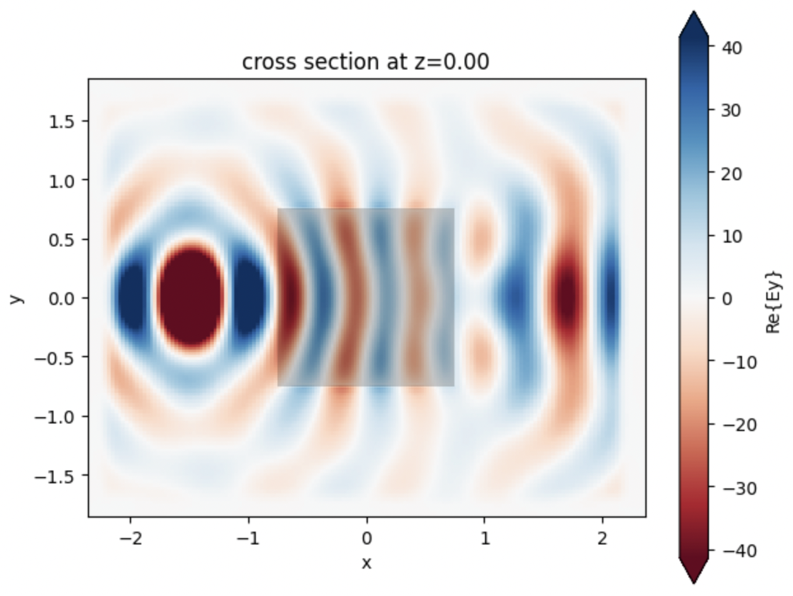

******************************
Tidy3D Electromagnetic Solver
******************************

.. role:: raw-html(raw)
    :format: html

.. image:: https://img.shields.io/badge/pypi-tidy3d-blue?style=for-the-badge
   :target: https://pypi.python.org/pypi/tidy3d
.. image:: https://img.shields.io/pypi/v/tidy3d.svg?style=for-the-badge
   :target: https://pypi.python.org/pypi/tidy3d/
.. image:: https://readthedocs.com/projects/flexcompute-tidy3ddocumentation/badge/?version=latest&style=for-the-badge
   :target: https://flexcompute-tidy3ddocumentation.readthedocs-hosted.com/?badge=latest
.. image:: https://img.shields.io/github/actions/workflow/status/flexcompute/tidy3d/run_tests.yml?style=for-the-badge
.. image:: https://img.shields.io/endpoint?url=https://gist.githubusercontent.com/daquinteroflex/4702549574741e87deaadba436218ebd/raw/tidy3d_extension.json
.. image:: https://img.shields.io/github/license/flexcompute/tidy3d?style=for-the-badge
.. image:: https://img.shields.io/badge/Demo-Notebooks-9647AE?style=for-the-badge
    :target: https://github.com/flexcompute/tidy3d-notebooks
.. image:: https://img.shields.io/badge/code%20style-black-000000.svg?style=for-the-badge
   :target: https://github.com/psf/black

Tidy3D is a software package for solving extremely large electrodynamics problems using the finite-difference time-domain (FDTD) method. It can be controlled through either an `open source python package <https://github.com/flexcompute/tidy3d>`_ or a `web-based graphical user interface <https://tidy3d.simulation.cloud>`_.

This python API allows you to:

* Programmatically define FDTD simulations.
* Submit and manage simulations running on Flexcompute's servers.
* Download and postprocess the results from the simulations.

Get Started
===========

.. tabs::

    .. group-tab:: On Linux |:penguin:| & MacOS |:apple:|

        Install the latest stable python library `tidy3d <https://github.com/flexcompute/tidy3d>`_ for creating, managing, and postprocessing simulations with

        .. code-block:: bash

            pip install --user tidy3d

        Next, configure your ``tidy3d`` package with the API key from your account.

        `Get your free API key <https://tidy3d.simulation.cloud/account?tab=apikey>`_

        .. code-block:: bash

           tidy3d configure --apikey=XXX

        And enter your API key when prompted.

        For more detailed installation instructions, see `this page <./install.html>`_.

    .. group-tab:: On Windows |:window:|

        Install the latest stable python library `tidy3d <https://github.com/flexcompute/tidy3d>`_ for creating, managing, and postprocessing simulations in your virtual environment with:

        .. code-block:: bash

            pip install --user tidy3d

        Next, configure your ``tidy3d`` package with the API key from your account.

        `Get your free API key <https://tidy3d.simulation.cloud/account?tab=apikey>`_

        To automatically configure the API key, you will need to install the following extra packages:

        .. code-block:: bash

            pip install pipx
            pipx run tidy3d configure --apikey=XXX

        If you're running into trouble, you may need to manually set the API key directly in the configuration file where Tidy3D looks for it.
        You need to place the ``$HOME/.tidy3d/config`` file in your home directory such as ``C:\Users\username\`` (where ``username`` is your username).

        The API key must be in a file called ``$HOME/.tidy3d/config`` located in your home directory, with the following contents

        .. code-block:: bash

            apikey = "XXX"

        You can manually set up your file like this, or do it through the command line line:

        .. code-block:: bash

            echo 'apikey = "XXX"' > ~/.tidy3d/config

        Note the quotes around `XXX`.

    .. group-tab:: In the Cloud |:cloud:|

        If you’d rather skip installation and run an example in one of our web-hosted notebooks, `click here <https://tidy3d.simulation.cloud/notebook?file=StartHere.ipynb>`_.

.. To do items:
.. * open simple example in colab with API saved as environment variable and `!pip install tidy3d` in the first line.
.. * toggle between command line - notebook / python instructions in section 1

Quick Example
=============

Start running simulations with just a few lines of code. Run this sample code to simulate a 3D dielectric box in Tidy3D and plot the corresponding field pattern.

.. code-block:: python

   # !pip install tidy3d # if needed, install tidy3d in a notebook by uncommenting this line

   # import the tidy3d package and configure it with your API key
   import numpy as np
   import tidy3d as td
   import tidy3d.web as web
   # web.configure("YOUR API KEY") # if authentication needed, uncomment this line and paste your API key here

   # set up global parameters of simulation ( speed of light / wavelength in micron )
   freq0 = td.C_0 / 0.75

   # create structure - a box centered at 0, 0, 0 with a size of 1.5 micron and permittivity of 2
   square = td.Structure(
       geometry=td.Box(center=(0, 0, 0), size=(1.5, 1.5, 1.5)),
       medium=td.Medium(permittivity=2.0)
   )

   # create source - A point dipole source with frequency freq0 on the left side of the domain
   source = td.PointDipole(
       center=(-1.5, 0, 0),
       source_time=td.GaussianPulse(freq0=freq0, fwidth=freq0 / 10.0),
       polarization="Ey",
   )

   # create monitor - Measures electromagnetic fields within the entire domain at z=0
   monitor = td.FieldMonitor(
       size=(td.inf, td.inf, 0),
       freqs=[freq0],
       name="fields",
       colocate=True,
   )

   # Initialize simulation - Combine all objects together into a single specification to run
   sim = td.Simulation(
       size=(4, 3, 3),
       grid_spec=td.GridSpec.auto(min_steps_per_wvl=25),
       structures=[square],
       sources=[source],
       monitors=[monitor],
       run_time=120/freq0,
   )

   print(f"simulation grid is shaped {sim.grid.num_cells} for {int(np.prod(sim.grid.num_cells)/1e6)} million cells.")

   # run simulation through the cloud and plot the field data computed by the solver and stored in the monitor
   data = td.web.run(sim, task_name="quickstart", path="data/data.hdf5", verbose=True)
   ax = data.plot_field("fields", "Ey", z=0)

This will produce the following plot, which visualizes the electromagnetic fields on the central plane.

You can now postprocess simulation data using the same python session, or view the results of this simulation on our web-based `graphical user interface <https://tidy3d.simulation.cloud>`_.

.. `TODO: open example in colab <https://github.com/flexcompute/tidy3d>`_

Further Information
====================

.. toctree::
  :maxdepth: 2

  install
  lectures/index
  notebooks/docs/index
  faq/docs/index
  api/index
  development/index
  changelog
  About our Solver <https://www.flexcompute.com/tidy3d/solver/>

Github Repositories
--------------------

.. list-table::
   :header-rows: 1

   * - Name
     - Repository
   * - Source Code
     - https://github.com/flexcompute/tidy3d
   * - Example Notebooks
     - https://github.com/flexcompute/tidy3d-notebooks
   * - FAQ Source Code
     - https://github.com/flexcompute/tidy3d-faq

These repositories are the a very good way to interact with the relevant tool developers.
We encourage you to ask questions or request features through the "Discussions" or "Issues" tabs of each repository accordingly.

