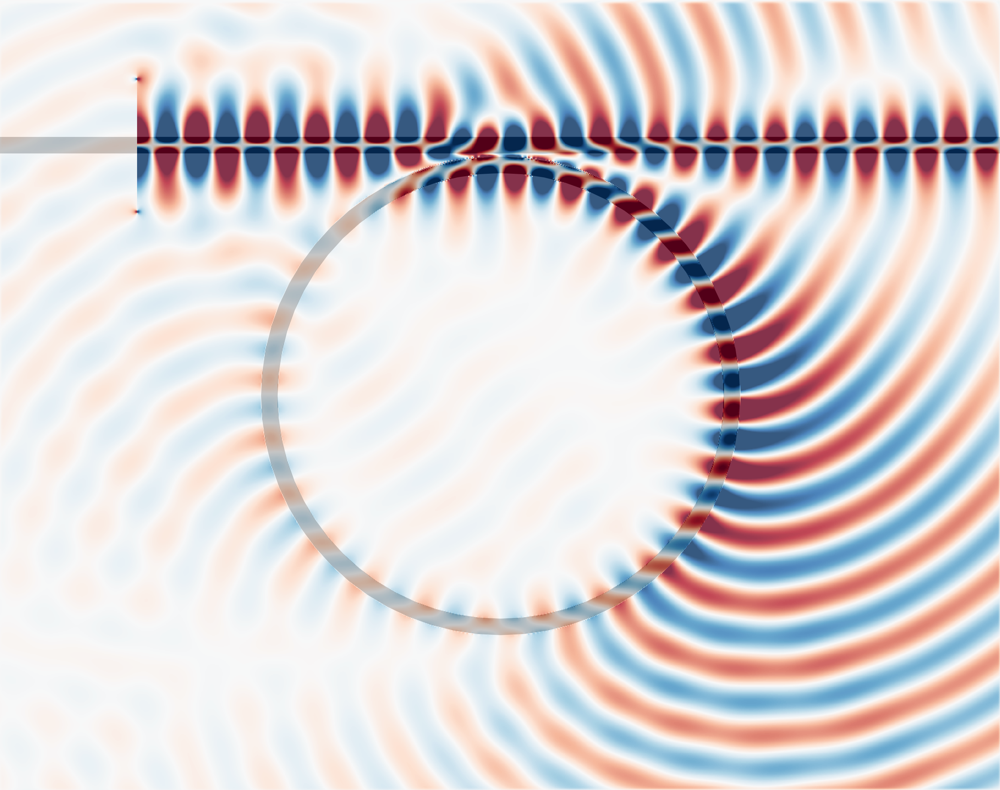

Tidy3D Documentation
====================

Tidy3D is a software package for solving extremely large electrodynamics problems using the finite-difference time-domain (FDTD) method.

This is the documentation for the python API, which is the main way to build simulation models, submit jobs, and analyze results of completed runs.

.. toctree::
   :maxdepth: 1
   :caption: User Guide

   quickstart
   notebooks/examples
   faq
   howdoi
   api
   changelog
   Tidy3D Solver Technology <https://www.flexcompute.com/tidy3d/solver/>

