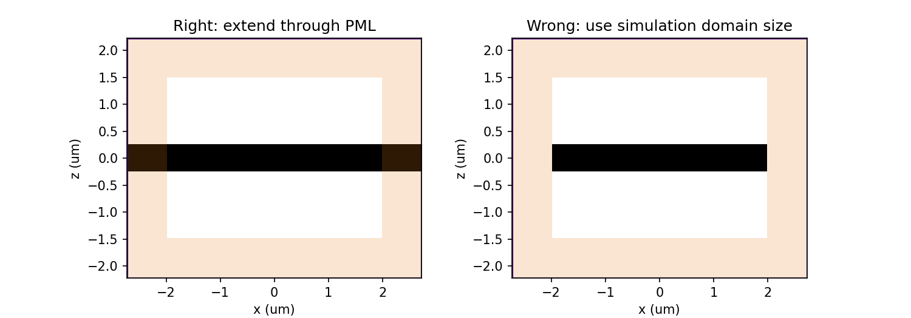

Frequently Asked Questions
==========================

How do I run a simulation and access the results?
-------------------------------------------------

Submitting and monitoring jobs, and donwloading the results, is all done 
through our `web API <api.html#web-api>`_. After a successful run, 
all data for all monitors can be downloaded in a single ``.hdf5`` file 
using :meth:`tidy3d.web.webapi.load`, and the
raw data can be loaded into a :class:`.SimulationData` object.

From the :class:`.SimulationData` object, one can grab and plot the data for each monitor with square bracket indexing, inspect the original :class:`.Simulation` object, and view the log from the solver run.  For more details, see `this tutorial <notebooks/VizSimulation.html>`_.

How is using Tidy3D billed?
---------------------------

The `Tidy3D client <https://pypi.org/project/tidy3d-beta/>`_ that is used for designing 
simulations and analyzing the results is free and 
open source. We only bill the run time of the solver on our server, taking only the compute 
time into account (as opposed to overhead e.g. during uploading).
When a task is uploaded to our servers, we will print the maximum incurred cost in Flex units.
This cost is also displayed in the online interface for that task.
This value is determined by the cost associated with simulating the entire time stepping specified.
If early shutoff is detected and the simulation completes before the full time stepping period, this
cost will be pro-rated.
For more questions or to purchase Flex units, please contact us at ``support@flexcompute.com``.

What are the units used in the simulation?
------------------------------------------

We assume the following physical units:

  - Length: micron (μm, :math:`10^{-6}` meters)
  - Time: Second (s)
  - Frequency: Hertz (Hz)
  - Electric conductivity: Siemens per micron (S/μm)

Thus, the user should be careful, for example to use the speed of light 
in μm/s when converting between wavelength and frequency. The built-in 
speed of light ``td.C_0`` has a unit of μm/s. 

For example:

.. code-block:: python

    wavelength_um = 1.55
    freq_Hz = td.C_0 / wavelength_um
    wavelength_um = td.C_0 / freq_Hz

Currently, only linear evolution is supported, and so the output fields have an 
arbitrary normalization proportional to the amplitude of the current sources, 
which is also in arbitrary units. In the API Reference, the units are explicitly 
stated where applicable. 

How do I add PML absorbing boundaries to my simulation?
-------------------------------------------------------

Upon initializing a simulation, the user can provide an optional argument ``pml_layers``, 
an array of three elements defining the PML boundaries along x, y, and z. The 
easiest way to define PML is to use e.g. ``pml_layers=(None, None, td.PML())`` 
to define PML in the z-direction only (in x and y, the default periodic boundaries will 
be used). It is also possible to customize the PML further as explained in the 
`documentation <https://docs.simulation.cloud/>`_ and below.

Tidy3D uses a complex frequency-shifted formulation of the perfectly-matched layers (CPML), 
for which it is more natural to define the thickness as number of layers rather than as 
physical size. We provide two pre-set PML profiles, 'standard' (:class:`.PML`) and 'stable' (:class:`.StablePML`.
The standard profile has 12 layers by default and should be sufficient in many situations. In the 
case of a diverging simulation, or when the fields do not appear to be fully absorbed in the PML, 
the user can increase the number of layers in the 'standard' profile (``PML(num_layers=20)``, or try the 'stable'
profile, which requires more layers (default is 40) but should generally work better. 
Adiabatic absorbing boundaries can be used as well through :class:`.Absorber`, which may improve stability over both PML types in certain situations.

**NB**: The PML layers extend **beyond** the simulation domain. This makes it easier not to worry 
about PMLs intruding into parts of your simulation where you don't want them to be. The one thing 
to keep in mind, however, is that structures that span the full simulation should also extend into 
the PML. So when defining such structures, it is best to extend them well beyond  
the simulation size. You could even use ``td.inf``, a shortcut for a very large value, for 
dimensions that span the full domain. Below is an example of a right and a wrong way to make a 
dielectric slab.

.. code-block:: python

    import tidy3d as td
    import matplotlib.pyplot as plt

    sim_size = [4., 4., 3.]
    pml_layers = [td.PML(), td.PML(), td.PML()]

    # Correct way: extend slab beyond simulation domain
    slab_right = td.Structure(
        geometry=td.Box(
            center=[0, 0, 0],
            size=[td.inf, td.inf, .5],
        ),
        medium=td.Medium(epsilon=5)
    )

    sim_right = td.Simulation(
        size=sim_size,
        grid_size=0.05,
        structures=[slab_right],
        pml_layers=pml_layers)

    # Wrong: use simulation domain size when using PML
    slab_wrong = td.Structure(
        geometry=td.Box(
            center=[0, 0, 0],
            size=[sim_size[0], sim_size[1], .5],
        ),
        medium=td.Medium(epsilon=5)
    )

    sim_wrong = td.Simulation(
        size=sim_size,
        resolution=20,
        structures=[slab_wrong],
        pml_layers=pml_layers)

    fig, ax = plt.subplots(1, 2, figsize=(11, 4))
    sim_right.plot_eps(y=0, ax=ax[0])
    sim_wrong.plot_eps(y=0, ax=ax[1])
    ax[0].set_title('Right: extend through PML')
    ax[1].set_title('Wrong: use simulation domain size')
    plt.show()

Notice that the simulation size in ``y`` is defined as 4 micron on initialization, 
but the full simulation domain with the PML layers is 5.5 micron. A large number of PML 
layers can thus lead to a significant increase of computation time in some cases.

Why is a simulation diverging?
------------------------------

Sometimes, a simulation is numerically unstable and can result in divergence. The two 
things that can be tuned to avoid that are the thickness of the PML layers and the Courant 
stability factor, each of which are defined upon initializing a simulation. If materials with 
frequency-independent permittivity smaller than one are included in the simulation, the 
Courant factor must be set to a value lower than the lowest refractive index. In the case of 
dispersive materials, understanding the reason for the instability is a matter of trial and error. 
Some things to try include:

- Remove dispersive materials extending into the PML.
- Increase the number of PML layers.
- Decrease the value of the Courant stability factor. Note that this leads to an inversely 
  proportional increase in the simulation time.

How do I include material dispersion?
-------------------------------------

Dispersive materials are supported in Tidy3D and we provide an extensive 
`material library <api.html#material-library>`_ with pre-defined materials. 
Standard `dispersive material models <api.html#dispersive-mediums>`_ can also be defined. 
If you need help inputting a custom material, let us know!

It is important to keep in mind that dispersive materials are inevitably slower to 
simulate than their dispersion-less counterparts, with complexity increasing with the 
number of poles included in the dispersion model. For simulations with a narrow range 
of frequencies of interest, it may sometimes be faster to define the material through 
its real and imaginary refractive index at the center frequency. This can be done by 
defining directly a value for the real part of the relative permittivity 
:math:`\mathrm{Re}(\epsilon_r)` and electric conductivity :math:`\sigma` of a :class:`.Medium`, 
or through a real part :math:`n` and imaginary part :math:`k`of the refractive index at a 
given frequency :math:`f`. The relationship between the two equivalent models is 

.. math::

    &\mathrm{Re}(\epsilon_r) = n^2 - k^2 

    &\mathrm{Im}(\epsilon_r) = 2nk

    &\sigma = 2 \pi f \epsilon_0 \mathrm{Im}(\epsilon_r)

In the case of (almost) lossless dielectrics, the dispersion could be negligible in a broad 
frequency window, but generally, it is importat to keep in mind that such a 
material definition is best suited for single-frequency results.

For lossless, weakly dispersive materials, the best way to incorporate the dispersion 
without doing complicated fits and without slowing the simulation down significantly is to 
include the value of the refractive index dispersion :math:`\mathrm{d}n/\mathrm{d}\lambda` 
in units of 1/micron when defining the :class:`.Medium`. The value is assumed to be 
at the central frequency or wavelength (whichever is provided), and a one-pole model for the 
material is generated. These values are for example readily available from the 
`refractive index database <https://refractiveindex.info/>`_.

Why can I not change Tidy3D instances after they are created?
-------------------------------------------------------------

You may notice in Tidy3D verions 1.5 and above that it is no longer possible to modify instances of Tidy3D components after they are created.
Making Tidy3D components immutable like this was an intentional design decision indended to make Tidy3D safer and more performant.

For example, Tidy3D contains several "validators" on input data.
If models are mutated, we can't always guarantee that the resulting instance will still satisfy our validations and the simulation may be invalid.

Furthermore, making the objects immutable allows us to cache the results of many expensive operations.
For example, we can now compute and store the simulation grid once, without needing to worry about the value becoming stale at a later time, which significantly speeds up plotting and other operations.

If you have a Tidy3D component that you want to recreate with a new set of parameters, instead of ``obj.param1 = param1_new``, you can call ``obj_new = obj.copy(update=dict(param1=param1_new))``.
Note that you may also pass more key value pairs to the dictionary in ``update``.
