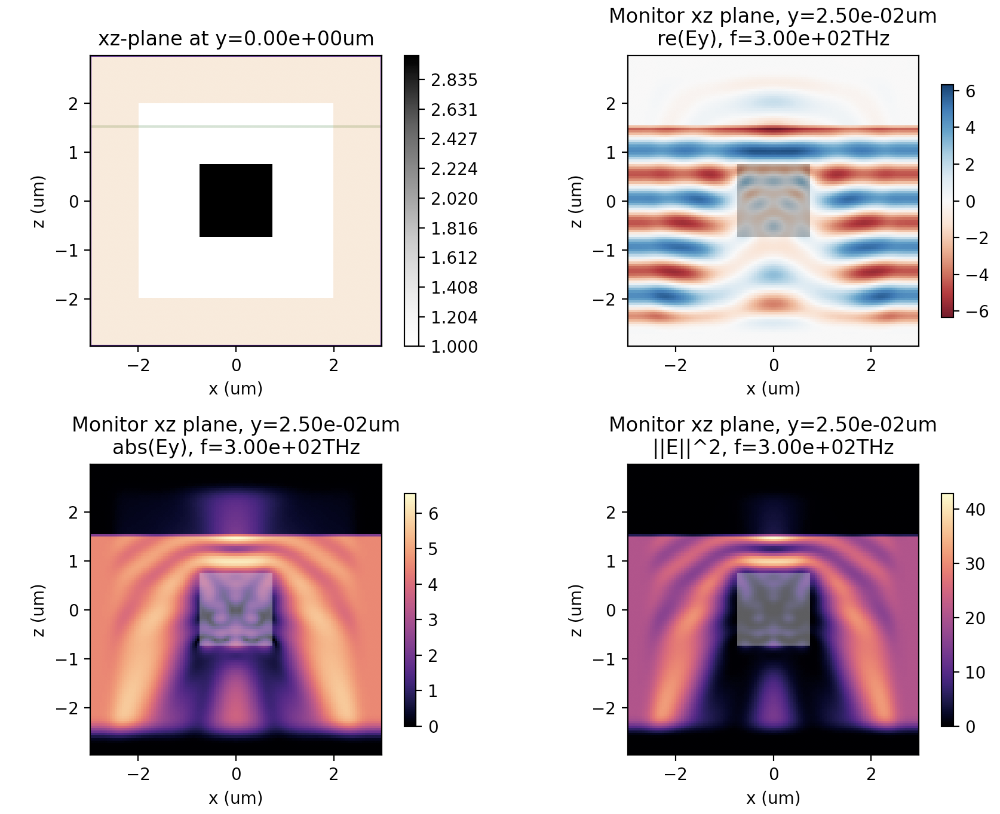

**********
Start Here
**********

Welcome to Tidy3d
=================

This page will get you set up with Tidy3D and running a simple example.

.. note:: This is the documentation for the beta release of Tidy3D.  If you were interested in our previous version, it is documented `at this page <https://simulation.cloud/docs/html/index.html>`_. 

Code Repositories
-----------------

We host several examples and tutorials at our `documentation repository <https://github.com/flexcompute-readthedocs/tidy3d-docs>`_ and its `notebook section <https://github.com/flexcompute-readthedocs/tidy3d-docs/tree/readthedocs/docs/source/notebooks>`_.

You can find our front end python code in its entirety at `this github repository <https://github.com/flexcompute/tidy3d>`_.  This is also a good place to ask questions or request features through the "Discussions" tab.

Getting Started
===============

Before using Tidy3D, you must first `sign up <https://client.simulation.cloud/register-waiting>`_ for a user account.

Signing up also grants you access to our browser-based `interface <https://tidy3d.simulation.cloud/account>`_ for managing simulations.

Quick Start (Colab Notebook)
----------------------------

`Click this text to get started running a Tidy3D simulation right away without any installation or software setup. <https://mybinder.org/v2/gh/flexcompute-readthedocs/tidy3d-docs/readthedocs?labpath=docs%2Fsource%2Fnotebooks%2FStartHere.ipynb>`_

Once there, to run the full example, select "Run -> Run All Cells".  Or you can click through the code blocks by pressing the "play" icon.

You will first be prompted to log in using the email and password you used for your user account.

Then the notebook will create a simulation and upload it to our server, where it will run for a few minutes before downloading the results and plotting the field patterns.

To play around with the simulation parameters, you can edit the notebook directly and re-run.

Python Installation
-------------------

If you have python set up on your computer and wish to run the python API locally, installation is simple.

Tidy3D and its dependencies can be installed from the command line by

.. code-block:: bash

    $ pip install tidy3d-beta

To test whether the installation was successful you can run

.. code-block:: bash

    $ python -c "import tidy3d as td; print(td.__verion__)"

or download and run an example script from `here <https://github.com/flexcompute-readthedocs/tidy3d-docs/blob/readthedocs/docs/StartHere.py>`_.

Next Steps
==========

That should get you started!  

To see some other examples of Tidy3D being used in large scale photonics simulations, see `Examples <./examples.html>`_.

To learn more about the many features of Tidy3D, check out our `Feature Walkthrough <./examples/Simulation.html>`_.

Or, if you're interested in the API documentation, see `API Reference <./api.html>`_.