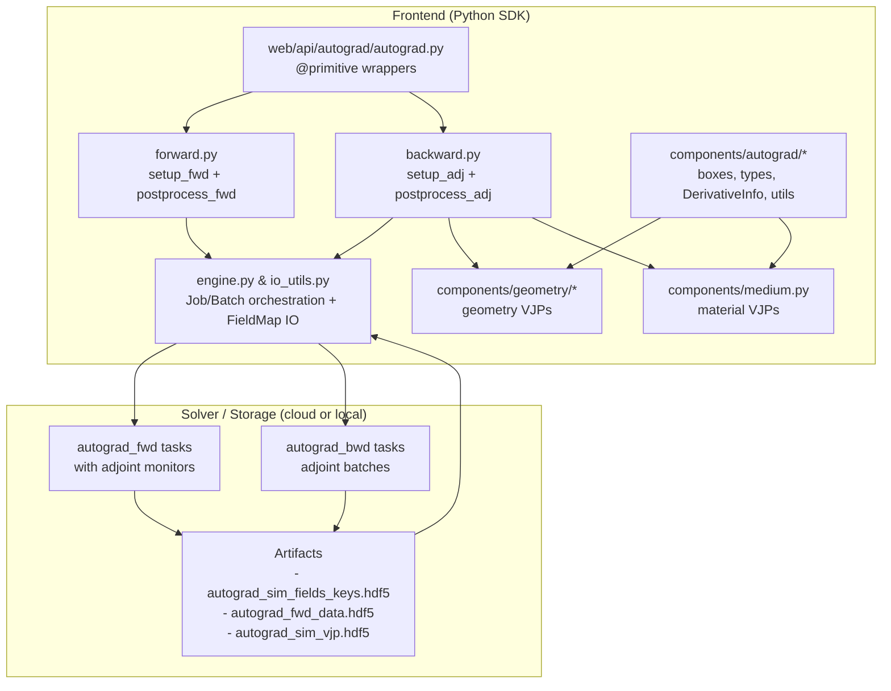
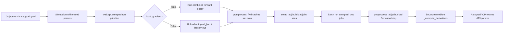
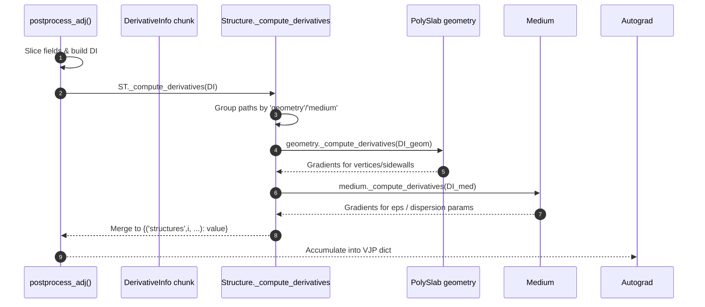

# Tidy3D Autograd Maintainer Guide

This document targets contributors who work on the native autograd stack. It complements `tidy3d/web/api/autograd/README.md` by focusing on internal interfaces, data contracts, and where new functionality must plug in.

## Scope & Key Modules
- `tidy3d/web/api/autograd/autograd.py`: entry points for `web.run` and `web.run_async` when traced parameters are present. Hosts the autograd `@primitive` wrappers, the defvjp registrations, and orchestration of local vs. server gradients.
- `tidy3d/web/api/autograd/{forward,backward,engine,io_utils}.py`: forward monitor injection, adjoint setup/post-processing, wrappers around `Job`/`Batch`, and serialization helpers (`FieldMap`, `TracerKeys`, `SIM_*` files).
- `tidy3d/components/autograd/`: tracer-aware NumPy shims (`boxes.py`), differentiable utilities (`functions.py`: `interpn`, `trapz`, `add_at`), tracing types (`types.py`), field mapping (`field_map.py`), and the `DerivativeInfo` contract (`derivative_utils.py`).
- Geometry & medium implementations (`tidy3d/components/{geometry,medium}.py`): provide `_compute_derivatives` overrides that consume `DerivativeInfo` and emit VJPs.
- Tests live under `tests/test_components/autograd/` and are the canonical signal for regressions in tracing, adjoint batching, and derivative formulas.

## Mathematical Foundation

The implementation follows the adjoint state method, enabling efficient gradient computation with just one forward and one adjoint simulation.

### Adjoint Method
1. **Forward Problem**: $\nabla \times \nabla \times E - k^2\varepsilon(p)E = -i\omega\mu_0 J$
2. **Objective Function**: $f = F(E(p))$
3. **Adjoint Problem**: $\nabla \times \nabla \times E^\dagger - k^2\varepsilon(p)E^\dagger = \partial F / \partial E$
4. **Parameter Gradient**: $\partial f / \partial p = \text{Re}[\int E^\dagger \cdot (\partial (k^2\varepsilon) / \partial p) \cdot E dV]$

### Derivative Types
- **Volume derivatives** (for material parameters $\varepsilon, \sigma$):
  Computed as $E_{fwd} \cdot E_{adj}$ integrated over the structure volume.
- **Surface derivatives** (for geometry boundaries):
  - Follows boundary perturbation theory (Veronis et al., *Optics Letters* 29(19):2288–2290, 2004).
  - Formula: $\int_{\partial V} (\Delta\varepsilon \mathbf{E}_{\parallel} \cdot \mathbf{E}_{\parallel}^\dagger - \Delta(\varepsilon^{-1}) \mathbf{D}_{\perp} \cdot \mathbf{D}_{\perp}^\dagger) dA$, where $\Delta$ denotes (inside - outside).
  - Implemented in `DerivativeInfo.evaluate_gradient_at_points`.

## Tracing Mechanics

The system relies on `HIPS/autograd` for automatic differentiation.

### TidyArrayBox
We use `TidyArrayBox` (an alias for autograd's `ArrayBox`) to wrap traced values.
- **Flow**: `params` (numpy array) -> `anp` operations -> `TidyArrayBox` -> `Structure` fields -> `Simulation`.
- **Extraction**: `Simulation._strip_traced_fields()` recursively extracts these boxes into an `AutogradFieldMap` before simulation execution.
- **Re-insertion**: After the simulation, results are mapped back to these boxes to continue the computation graph.

## Architecture at a Glance

## Forward (primal) data flow
1. **Tracer detection** – `setup_run()` calls `Simulation._strip_traced_fields(..., starting_path=("structures",))` to collect an `AutogradFieldMap`. `is_valid_for_autograd()` enforces traced content, at least one frequency-domain monitor, and `config.adjoint.max_traced_structures` (`tidy3d/web/api/autograd/autograd.py`).
2. **Static snapshot & payload** – The simulation is frozen via `Simulation.to_static()`. When tracers exist, `Simulation._serialized_traced_field_keys(...)` stores `TracerKeys` in `TRACED_FIELD_KEYS_ATTR` so solver sidecars know which structural slots to differentiate.
3. **Monitor injection** – `setup_fwd()` (delegating to `tidy3d/web/api/autograd/forward.py`) asks `Simulation._with_adjoint_monitors(sim_fields)` to duplicate the job with structure-aligned `FieldMonitor` and `PermittivityMonitor` objects. Low-level placement happens in `Structure._make_adjoint_monitors()` (`tidy3d/components/structure.py`), which consults `config.adjoint.monitor_interval_poly/custom` and adds H-field sampling for PEC materials.
4. **Primitive invocation** – `_run_primitive()` marks the task as `simulation_type="autograd_fwd"` when gradients stay on the server. Local gradients run the combined simulation directly; remote gradients call `_run_tidy3d()`/`_run_async_tidy3d()` with upload-time hooks to send `autograd_sim_fields_keys.hdf5`.
5. **Auxiliary caching** – `postprocess_fwd()` splits the solver output into user data vs. gradient monitors. It populates `aux_data[AUX_KEY_SIM_DATA_ORIGINAL]` and `aux_data[AUX_KEY_SIM_DATA_FWD]`, returning only the tracer-shaped dictionary that autograd sees as the primitive output. These cached blobs are mandatory for the later VJP.

### High-level execution flow

## Backward (adjoint) data flow & batching
1. **Gradient request** – When autograd calls the registered VJP (`_run_bwd` or `_run_async_bwd`), the wrapper pulls `sim_fields_keys`, the original `SimulationData`, and (for local gradients) the stored forward monitor data.
2. **Adjoint source assembly** – `setup_adj()` zero-filters user VJPs, reinserts them into the `SimulationData`, and asks `SimulationData._make_adjoint_sims(...)` to build one adjoint simulation per unique `(monitor, frequency, polarization)` bucket. The limit is enforced via `max_num_adjoint_per_fwd` (call argument or defaulting to `config.adjoint.max_adjoint_per_fwd`).
3. **Batch execution** – Local gradients reuse `_run_async_tidy3d` with `path_dir / config.adjoint.local_adjoint_dir`; remote gradients mutate each adjoint sim to `simulation_type="autograd_bwd"`, link them to the forward task via `parent_tasks`, and rely on `_run_async_tidy3d_bwd()` plus `_get_vjp_traced_fields()` to download `output/autograd_sim_vjp.hdf5`.
4. **Adjoint post-processing** – `tidy3d/web/api/autograd/backward.postprocess_adj()` pulls forward (`fld_fwd`, `eps_fwd`) and adjoint (`fld_adj`, `eps_adj`) monitors, builds `E_der_map`, `D_der_map`, and optional `H_der_map` via `get_derivative_maps()`, and converts E-fields to D-fields with `E_to_D()`. Frequency batching honors `config.adjoint.solver_freq_chunk_size` to trade memory for CPU.
5. **Derivative dispatch** – The routine constructs a `DerivativeInfo` (see below) per chunk, forwards it into `Structure._compute_derivatives()`, and accumulates the returned dict `{('structures', i, 'geometry', ...): gradient}` across adjoint simulations before returning to autograd.

## DerivativeInfo contract (tidy3d/components/autograd/derivative_utils.py)
`DerivativeInfo` centralizes every tensor the geometry/medium code needs. Key expectations:
- `paths`: tuple of relative paths inside `Structure.geometry` or `.medium` that must be filled with gradients.
- `E_der_map`, `D_der_map`, `H_der_map` (optional) : dictionaries mapping field-component names (e.g., `Ex`, `eps_xx`) to `ScalarFieldDataArray`s already multiplied element-wise (`E_fwd * E_adj`, etc.).
- `E_fwd`, `E_adj`, `D_fwd`, `D_adj`, `H_*`: raw fields for terms that require asymmetric handling (e.g., PEC tangential enforcement).
- `eps_data`: slice of the permittivity monitor on the same grid; `eps_in`, `eps_out`, `eps_background`, `eps_no_structure`, and `eps_inf_structure` cover cases where the monitor cannot deliver inside/outside material automatically (geometry groups, approximations, PEC detection).
- `bounds`, `bounds_intersect`, `simulation_bounds`: cached bounding boxes for clipping integrals; all derived from simulation + geometry differences.
- `frequencies`: the chunked frequency array currently being reduced; geometry implementations must sum over this subset because `postprocess_adj()` loops over slices.
- `eps_approx`, `is_medium_pec`, `interpolators`: flags and caches that geometry/medium code can honor to shortcut expensive recomputation across related shapes.
Use `DerivativeInfo.updated_copy(deep=False, paths=...)` to retarget subsets while sharing cached interpolators. Geometry code is expected to tolerate NaNs by calling `_nan_to_num_if_needed` before evaluating interpolators.

## Custom VJP providers
`Structure._compute_derivatives()` fans gradients out to the relevant constituent objects. Every class below defines `_compute_derivatives()` and therefore must be updated whenever the contract changes:

**Geometry stack**
- `Geometry` (base dispatch) – `tidy3d/components/geometry/base.py`. Handles shared surface integrals (normal/tangential D/E terms) and loops over child geometries.
- `Box` – `tidy3d/components/geometry/base.py`. Implements closed-form face quadratures; used for axis-aligned primitives.
- `Cylinder` – `tidy3d/components/geometry/primitives.py`. Generates adaptive azimuthal sampling controlled by `config.adjoint.points_per_wavelength`, etc.
- `PolySlab` – `tidy3d/components/geometry/polyslab.py`. Handles polygon meshes, including sidewall extrusion and vertex-by-vertex derivatives.
- `GeometryGroup` – `tidy3d/components/geometry/base.py`. Splits groups into constituent geometries, toggles `DerivativeInfo.eps_approx`, and shares cached interpolators.

**Medium stack** (`tidy3d/components/medium.py`)
- `AbstractMedium` (base) and `Medium` – implement the generic volume integral with `E_der_map`/`D_der_map`.
- Dispersion families each override `_compute_derivatives()` to wire frequency-dependent parameters into the adjoint accumulation: `CustomMedium`, `PoleResidue`/`CustomPoleResidue`, `Sellmeier`/`CustomSellmeier`, `Lorentz`/`CustomLorentz`, `Drude`/`CustomDrude`, `Debye`/`CustomDebye`. Any new dispersive model must emit gradients for both pole frequencies and residues, respecting `config.adjoint.gradient_dtype_*`.

### Example: PolySlab derivative dispatch

## Configuration & local-vs-server gradients
- `config.adjoint.local_gradient`: when `True`, all computations happen locally, stored under `path.parent / config.adjoint.local_adjoint_dir`, and every other `config.adjoint` override takes effect. When `False` (default), overrides besides `local_gradient` are ignored (see `apply_adjoint()`), because backend defaults guarantee reproducibility.
- `config.adjoint.max_traced_structures`: enforced in `is_valid_for_autograd()` before any run is uploaded. Increase cautiously because each structure inserts its own monitor pair.
- `config.adjoint.max_adjoint_per_fwd`: default for `max_num_adjoint_per_fwd` in `run()`/`run_async()`. If backend returns more adjoint sims than this limit, `setup_adj()` raises `AdjointError` early.
- `config.adjoint.solver_freq_chunk_size`: drives per-chunk slicing inside `postprocess_adj()` so streaming geometries or high-resolution spectra do not explode memory usage.
- `config.adjoint.monitor_interval_poly` / `monitor_interval_custom`: control the spatial sampling density for the auto-inserted monitors; geometry-specific overrides decide which tuple to use based on whether medium parameters are traced.
- `config.adjoint.gradient_precision`: influences dtype selection within `DerivativeInfo` consumers (e.g., `medium.py` uses `config.adjoint.gradient_dtype_float`).
- Other knobs (quadrature order, wavelength fractions, edge clipping tolerances) are consumed by geometry helpers throughout `tidy3d/components/geometry/base.py` & `primitives.py`. Favor these settings instead of sprinkling new constants.

## Serialization artifacts
- **TracerKeys (`autograd_sim_fields_keys.hdf5`)** – produced from `AutogradFieldMap` via `TracerKeys.from_field_mapping()` and uploaded before remote forward runs. They allow the backend to match traced tensors to structural indices, even when the python-side order changes.
- **Forward data (`AUX_KEY_SIM_DATA_*`)** – always cached locally, even when gradients are done remotely, because `postprocess_run()` rehydrates the user-visible `SimulationData` by copying autograd boxes back onto `sim_data_original`.
- **VJP data (`output/autograd_sim_vjp.hdf5`)** – downloaded automatically for server adjoints via `_get_vjp_traced_fields()` and converted back into `AutogradFieldMap` objects using `FieldMap.from_file().to_autograd_field_map`.

## Testing expectations
- Fast unit coverage lives in `tests/test_components/autograd/`. Core suites:
  - `test_autograd.py`: integration harness that patches the pipeline, emulates server responses, and checks tracing edge cases (e.g., `TRACED_FIELD_KEYS_ATTR`).
  - `test_autograd_dispersive_vjps.py` and `_custom_*` variants: assert each dispersive medium’s `_compute_derivatives()` matches analytic expectations.
  - `test_autograd_polyslab*.py`, `test_autograd_rf_*`, and `test_sidewall_edge_cases.py`: stress geometry-derived gradients, particularly for `PolySlab` and right-facing (RF) boxes.
  - `tests/test_components/autograd/numerical/`: longer-running numerical comparisons enabled via `poetry run pytest -m numerical tests/test_components/autograd/numerical -k case_name` once maintainers approve the simulation cost.
- Always run `poetry run pytest tests/test_components/autograd -q` after touching this stack. Enable `RUN_NUMERICAL` or pass `-m numerical` only when you are ready to run solver-backed adjoints.

## Additional references
- When exposing new public APIs, update the user-facing docs under `docs/` and reference this README so contributors understand the tracing implications.
