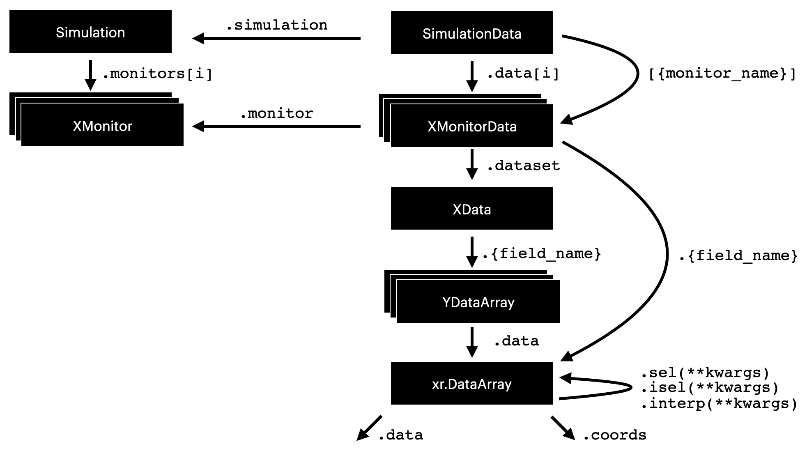

# Tidy3d Data

This document will overview how datastructures are organized in the data refactor set to launch in 2.0.

A diagram explaining the basic organization is shown below.




## Files

The data organization lives in `tidy3d/components/data` directory.

The directory contains three files:

- `data_array.py` defines `DataArray` and its subclasses. These objects hold a single field `.data`, which holds a `xarray.DataArray` with dimensions defined in the `DataArray` class. For example, a `ScalarFieldDataArray` holds a single `.data` object, which is an `xarray.DataArray` with dimenensions `('x', 'y', 'x', 'f')`, storing a scalar field in the frequency domain.
- `dataset.py` defines the `Dataset`, which is effectively a collection of `DataArray` objects as pydantic fields. For example `FieldData` is a `Dataset` with `.Ex`, `.Ey`, etc. fields, each storing a `ScalarFieldDataArray` object.
- `monitor_data.py` defines the `MonitorData` classes, which basically associate a given `Monitor` with a `Dataset`, as the `.monitor` and `.dataset` fields, respectively.
- `sim_data.py` holds the `SimulationData`, which holds a tuple of `MonitorData` objects, as well as the `Simulation`. These `MonitorData` objects have a direct correspondence to the `Simulation.monitors` list and are linked by the `Monitor.name`.

## Structure

### ``DataArray`` Objects

The most atomic datastructure defined as a `Tidy3dBaseModel` is the `DataArray`.

A `DataArray` holds a dataset with a multidimensional array and labelled coordinates. For example, a scalar field, flux over time, etc.

The dataset itself is a `xarray.DataArray` stored in `DataArray.data` and supports all of the selection, indexing, and plotting features.

The `DataArray` subclasses are simply templates, which define the dimensions and attributes of the data expected as class variables.  For example:

```python
class ScalarFieldTimeDataArray(DataArray):
    """Spatial distribution in the time-domain."""
    _dims = ("x", "y", "z", "f")
    _data_attrs = {"long_name": "field value"}
```

Defines a scalar field in the time-domain, which must have coordinates with keys `"x"`, `"y"`, `"z"`, and `"t"` and we've given the values a long name for plotting purposes. When the `xarray.DataArray` is supplied to a `DataArray`, the dims are checked against `_dims` and the `_data_attrs` are applied to the `xr.DataArray` as well as coordinate attributes stored as constants in the file.

There is a `@classmethod` convenience constructor `DataArray.from_data_coords(data, coords)` which constructs a `DataArray` without needing to call `xarray.DataArray(data, coords)` directly.

The naming convention for `DataArray` objects is to append `DataArray` to the name of the stored quantity, ie. "`FluxDataArray`.

TLDR: We use these `DataArray` instances primarily as a template for how to define the various labelled, multi-dimensional datasets we use to store the raw data.

### `Dataset` objects

`Dataset` objects store a collection of `DataArray` objects as pydantic fields. For example, a vector field might be defined as a `Dataset` containing a `ScalarFieldDataArray` for each vector component (`.x`, `.y`, and `.z`).

These `Dataset` objects also contain various convenience methods, which can perform transformations or processing on their contained data. For example, applying symmetry, getting field components that are non-None.

Both `Dataset` and `DataArray` objects are designed to be completely independent of the other Tidy3d components, such as Sources, Monitors. In this way, they can be used to define custom components, such as custom current sources, without introducing circular dependencies.

### `MonitorData` objects

The `MonitorData` objects store a `Dataset` for a single type of `Monitor`. There is a one-to-one correspondence with each `Monitor` type.  

As such, each `MonitorData` contains a `.monitor` and `.dataset` field, which hold the `Monitor` and `Dataset` respectively. If a monitor is named "`XMonitor`", the convention is that the corresponding `Dataset` is called `XData` and the corresponding `MonitorData` is called "`XMonitorData`".

Like `Dataset` objects, `MonitorData` objects contain methods that do various operations on their data. However, since `MonitorData` objects are not designated as "pure" (they can depend on Tidy3d components), these methods are often designed to operate using other tidy3d components in mind. For example, some `MonitorData` objects have `.normalize()` functions, which take source spectrum information. Often, these methods strip parameters from the `.monitor` and pass them to the generic methods defined in `.dataset`.

As a final note, `MonitorData` subclasses contain several `property` getters that are used to conveniently access the `xarray.DataArray` data contained in their `.dataset` fields.

For example, `FluxMonitorData.flux` is a property that provides a shortcut to the `xarray.DataArray` containing the flux as a function of frequency, which would normally be accessed via `FluxMonitorData.dataset.flux.data`.


#### Normalization

As mentioned, many (typically frequency-domain) `MonitorData` subclasses have a `.normalize()` method, which returns a copy of the instance normalized by a given source spectrum.

```python
def normalize(self, source_spectrum_fn: Callable[[float], complex]) -> MonitorData:
```

Rather than raw data being passed to this, `source_spectrum_fn` is a function of frequency that returns the complex-valued source spectrum.  This was done to simplify things at the `SimulationData` level and provide more customizability.


#### Symmetry

Many `MonitorData` subclasses also have an `.apply_symmetry()` method, whch returns a copy of the instance with symmetry applied. There is therefore no notion of "state" with regard to the symmetry of a monitor data.

```python
def apply_symmetry(
    self,
    symmetry: Tuple[Symmetry, Symmetry, Symmetry],
    symmetry_center: Coordinate,
    grid_expanded: Grid,
) -> MonitorData:
```

#### Field-Like Data

The `Dataset` subclass `AbstractFieldData` defines a few methods and properties needed to propertly handle field-like data, such as `FieldData`, `FieldTimeData`, `PermittivityData`, and `ModeSolverData`.

There are a few convenient properties defined for each `AbstractFieldData`:

- `.field_components` is a dict mapping of the field name (str, eg. 'Ey') to the scalar field `DataArray`. It is very useful for iterating through the components and selecting by string.
- `.grid_locations` is a dict mapping of the field name to the "grid_key" used to select the postition in the yee lattice. For example, for a `PermittivityMonitor` called `p`, we would have `p.grid_locations['eps_yy'] == 'Ey'`.
- `.symmetry_eigenvalues` returns a dict mapping of the field name to a function of axis (0,1,2) that returns the eignenvalue of that field component under symmetry transformation along this axis.

Field-like data also support `def colocate(x=None, y=None, z=None) -> xr.Dataset`, which returns an `xarray.Dataset` of all the field components colocated at the supplied x,y,z coordinates. If any of the coordinates are `None`, nothing is done to colocate along that coordinate.

### `SimulationData` objects

The `SimulationData` object contains all of the data for a given `Simulation`. The `Simulation` is stored directly as a field `.simulation` and the `.data` field stores a tuple of `MonitorData` objects. The `.monitor_data` property returns a dictionary mapping the monitor names to the corresponding `MonitorData` contents, which is consistent with the previous versions of Tidy3d.

#### Normalizing

The frequency-dependent data in `SimulationData` objects is normalized to the source given by `SimulationData.simulation.normalize_index`, such that it matches exactly what is written to file (as opposed to the old workflow of the file containing un-normalized data). A copy of the `SimulationData` with a different normalization can be obtained using the

Normalization is achieved through the 
```python
def renormalize(self, normalize_index: int) -> SimulationData:`
```
method.

#### Applying Symmetry

Again, `SimulationData` objects have no notion of state regarding the symmetry. But they do contain a method
```python
def apply_symmetry(self, monitor_data: MonitorDataType) -> MonitorDataType:
```
which computes the expanded grid for a monitor and then returns a symmetry-applied version of the monitor data.

#### Selecting Monitor Data

Selection with square brackets (`sim_data[monitor_name]`) returns a copy of that monitor data with symmetry and normalization applied using the functions described above. Accessing the monitor_data through the `SimulationData.data` tuple or `SimulationData.monitor_data` dictionary gives direct access if desired However, one should use with caution as symmetry and normalization are not applied and modification of the result will mutate the contents of the original `SimulationData` rather than modifying a copy.

#### Getting Fields
There are a few other convenience methods for dealing with ``AbstractFieldData`` objects stored in the `SimulationData.data` tuple.
`sim_data.at_centers(monitor_name)` gets the field-like data at the yee cell centers.
`sim_data.get_intensity(monitor_name)` gets the intensity data for a field-like data evaluated at the yee cell centers.

#### Plotting

Plotting is very similar to before, except now instead of `freq`, `time`, `mode_index` and the spatial coordinates being explicitly defined as their own kwargs, the `plot_field` method accepts `**sel_kwargs`.

`**sel_kwargs` are any extra kwargs that can be applied through `.interp()` to the field-like data to get it into the proper form for plotting, namely a state where there are only two spatial coordinates with more than one value.

For example, if the data contains `x,y,z,f,mode_index` data, one could supply `z=0, f=4e14, mode_index=2` to the `plot_field()` as `**sel_kwargs` to get it into the form needed to plot field(x,y) on the z=0 plane. If there was only one frequency in the data, the `f`  could safely be left out of the `**sel_kwargs`. The code will automatically detect the proper axis position for plotting.

## File IO

### JSON

`SimulationData` and `MontorData` objects inherit directly from `Tidy3dBaseModel` and can be written directly to json. `DataArray` objects can also be written to json as we define a json encoder that uses [`xarray.DataArray.to_dict()`](https://docs.xarray.dev/en/stable/generated/xarray.DataArray.to_dict.html`). Therefore, an entire `SimulationData`, `MonitorData`, or `DataArray` object can be written to json without issue. However, it is worth noting that hdf5 is highly preferred over json when data is contained in the object, as json writing of data will be very slow.

### HDF5

We may also write any tidy3d component to hdf5. The logic for this is defined in `Tidy3dBaseModel` and involves a recursive writing and reading of files to hdf5 groups.

To write object `obj` to hdf5 format, simply use `obj.to_file(path)` where the path includes `.hdf5` as the extension.


