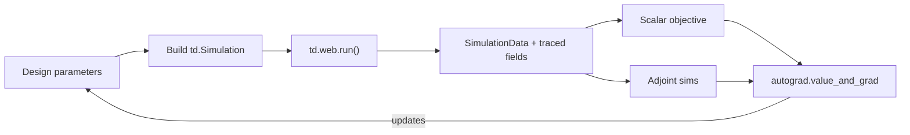

# Automatic Differentiation in Tidy3D

As of version 2.7.0, Tidy3D provides native support for automatic differentiation (AD), empowering you to perform gradient-based optimization and sensitivity analysis of photonic devices directly within your simulation workflow.

The gradient calculation is performed efficiently using the **adjoint method**, which requires typically only one additional simulation per gradient evaluation, regardless of the number of design parameters. This makes it feasible to optimize devices with thousands of parameters.

This implementation is powered by the `autograd` library and replaces the previous `jax`-based `adjoint` plugin, offering several key benefits:

*   **Simplicity**: Use standard Tidy3D components like `td.Structure` and `td.Simulation` directly in your differentiable functions.
*   **Ease of Use**: The main `td.web.run` and `td.web.run_async` functions are directly differentiable.
*   **Painless Installation**: The core AD framework, `autograd`, is a direct dependency of Tidy3D, removing the installation challenges associated with `jax`.

## Legacy Adjoint Plugin Reminder

The former `tidy3d.plugins.adjoint` (JAX) plugin was deprecated in 2.7 and is fully removed in 2.10. If you are updating older notebooks:

1. Replace `tidy3d.plugins.adjoint` imports (`tda.JaxSimulation`, `tda.JaxStructure`, etc.) with the standard `tidy3d` classes.
2. Switch `jax.grad` / `jax.numpy` to `autograd.grad` / `autograd.numpy`.
3. If you need PyTorch-centric tensors, use the lightweight wrapper in `tidy3d.plugins.pytorch` so you can keep your optimizer stack without touching `jax`.

For new projects, start directly with the native workflow described below.

## How It Works: `autograd` and the Adjoint Method

Tidy3D's AD capability combines two core technologies:

1.  **The `autograd` Framework**: This library automatically tracks all numerical operations in your Python objective function, building a computational graph to calculate derivatives using the chain rule.
2.  **The Adjoint Method**: Tidy3D has "taught" `autograd` how to differentiate the FDTD simulation step (`td.web.run`). This custom derivative rule is implemented using the adjoint method, a powerful technique that computes the gradient with respect to all design parameters using just one extra (adjoint) simulation.

When you request a gradient, Tidy3D and `autograd` work together behind the scenes:
1.  **Forward Pass**: Your code executes, running a standard FDTD simulation and calculating your scalar objective value. Tidy3D automatically stores the fields required for the subsequent gradient calculation.
2.  **Backward Pass**: `autograd` propagates gradients backward. When it reaches the simulation step, Tidy3D's custom rule takes over, sets up and runs an adjoint simulation, and uses both forward and adjoint fields to efficiently compute the gradients with respect to all design parameters.

### Forward/Adjoint Flow



## Basic Workflow

An inverse design optimization loop in Tidy3D generally follows these steps:

1.  **Define a function** that creates your `td.Simulation` based on a set of design parameters.
2.  **Define an objective function** that:
    *   Takes the design parameters as input.
    *   Calls the simulation-creation function.
    *   Runs the simulation via `td.web.run()`.
    *   Post-processes the results from the `SimulationData` object to return a single, real scalar value (the figure of merit).
3.  **Get the gradient function** using `autograd.value_and_grad()`.
4.  **Run an optimization loop** that iteratively calls the value-and-gradient function and updates the parameters using the computed gradient.

## Key Features at a Glance

* **Geometry + Material coverage**: Optimize most geometries (including `PolySlab` sidewall angles or `TriangleMesh` vertices) and dispersive media without custom wrappers.
* **Topology-friendly workflows**: `CustomMedium` plus the plugin’s filters/projections let you impose fabrication constraints while staying differentiable.
* **Broadband + adjoint throttling**: A single broadband source can drive gradients; adjoint jobs are auto-grouped and limited by `max_num_adjoint_per_fwd`.
* **Circuit and batch gradients**: `td.web.run` transparently differentiates `run_async` batches and S-matrix modelers whenever any child sim is autograd-ready.
* **Far-field aware**: Near-field monitors feed local `FieldProjector` steps so you can optimize flux or far-field metrics even though server-side projections stay fixed.

**Example: A Simple Optimization**
```python
import autograd
import autograd.numpy as anp
import tidy3d as td

# 1. Function to create the simulation from parameters
def make_simulation(width):
    # ... (define sources, monitors, etc.)
    geometry = td.Box(size=(width, 0.5, 0.22))
    structure = td.Structure(geometry=geometry, medium=td.Medium(permittivity=12.0))
    sim = td.Simulation(
        # ... (simulation parameters)
        structures=[structure],
        # ...
    )
    return sim

# 2. Objective function returning a scalar
def objective_fn(width):
    sim = make_simulation(width)
    sim_data = td.web.run(sim, task_name="optimization_step")
    # Objective: maximize power in the fundamental mode
    mode_amps = sim_data["monitor_name"].amps.sel(direction="+", mode_index=0)
    return anp.sum(anp.abs(mode_amps.values)**2)

# 3. Get the value and gradient function
value_and_grad_fn = autograd.value_and_grad(objective_fn)

# 4. Optimization loop (naive gradient ascent)
params = anp.array([2.0])  # Initial width
learning_rate = 0.05

for i in range(20):
    value, gradient = value_and_grad_fn(params)
    params = params + learning_rate * gradient  # move uphill to maximize
    print(f"Step {i+1}: Value = {value:.4f}, Width = {params[0]:.3f}")
```

> **Frequency-domain monitor required**: Any simulation that carries traced structures or media must include at least one frequency-domain monitor (`FieldMonitor`, `ModeMonitor`, `DiffractionMonitor`, etc.). If only time-domain data are present, `td.web.run` automatically falls back to the non-differentiable path and raises an `AdjointError`. Keep at least one spectral sample active on every monitor that participates in the objective.

### Common Pitfalls

* Use `autograd.numpy` for every array operation in your objective; mixing standard NumPy silently drops gradients.
* Narrow the monitors to the frequencies that actually enter the objective or `max_num_adjoint_per_fwd` will balloon and block the run.
* Keep an eye on the traced-structure budget (default 500). Group repeated tiles or motifs into a `GeometryGroup` before differentiating large layouts.

## Capabilities and Supported Components

Tidy3D's AD framework supports a wide range of design scenarios.

### Differentiable Parameters (Simulation Inputs)

#### Geometry

| Component       | Traceable Attributes                                       | Example Use Case                  |
|:----------------|:-----------------------------------------------------------|:----------------------------------|
| `Box`           | `.center`, `.size`                                         | Shape Optimization                |
| `Cylinder`      | `.center`, `.radius`, `.length`                            | Shape Optimization                |
| `PolySlab`      | `.vertices`, `.slab_bounds`, `.sidewall_angle`, `dilation` | Shape Optimization & taper tuning |
| `GeometryGroup` | `.geometries`                                              | Grouping for performance          |
| `TriangleMesh`  | `.mesh_dataset.surface_mesh`                               | 3D Shape Optimization             |

#### Base Materials

| Component                 | Traceable Attributes | Example Use Case                           |
|:--------------------------| :--- |:-------------------------------------------|
| `Medium`                  | `.permittivity` (isotropic, non-dispersive) | Material Optimization                      |
| `CustomMedium`            | Permittivity data array | Topology Optimization                      |
| `AnisotropicMedium`       | Permittivity data array | Material Optimization of Photonic Crystals |
| `CustomAnisotropicMedium` | Permittivity data array | Topology Optimization of Photonic Crystals |

#### Dispersive Models

| Component | Traceable Attributes | Example Use Case |
| :--- | :--- | :--- |
| `PoleResidue` | `.eps_inf`, `.poles` | General dispersive fit |
| `CustomPoleResidue` | `.eps_inf`, `.poles` (spatial data) | Spatially varying dispersive fit |
| `Sellmeier` / `CustomSellmeier` | `coeffs[i][0]` (B) and `coeffs[i][1]` (C) | Refractive-index dispersion control |
| `Lorentz` / `CustomLorentz` | `eps_inf`, `(Δε_i, f_i, δ_i)` | Resonant material modeling |
| `Drude` / `CustomDrude` | `eps_inf`, `(f_{p,i}, δ_i)` | Free-carrier / plasmonic tuning |
| `Debye` / `CustomDebye` | `eps_inf`, `(Δε_i, τ_i)` | Relaxation media / polymers |

### Differentiable Results (Simulation Outputs)

| Source monitor → data object | Traceable attributes & methods | Notes |
| :--- | :--- | :--- |
| `ModeMonitor` → `ModeData` | `.amps` | Differentiate modal amplitudes and powers directly. |
| `DiffractionMonitor` → `DiffractionData` | `.amps` | Capture gradients of diffraction efficiencies / orders. |
| `FieldMonitor` / `PermittivityMonitor` → `FieldData`, `PermittivityData` | `.Ex`, `.Ey`, `.Ez`, `eps_xx`, etc. | Use these to build custom objectives (power, overlap, material penalties). |
| `SimulationData` helpers | `get_intensity(field_monitor_name)`, `get_poynting_vector(field_monitor_name)` | Convenience wrappers remain differentiable because they operate on traced monitor data. |

#### Requires Local Post-processing

| Data target | Status |
| :--- | :--- |
| `FluxMonitor` (`FluxData`) | Not directly differentiable. Record the enclosing `FieldMonitor` and integrate the Poynting vector yourself. |
| Field projection monitors (`FieldProjectionAngleData`, `FieldProjectionCartesianData`, `FieldProjectionKSpaceData`) | Not supported for adjoint. Store the near fields and run `FieldProjector.from_near_field_monitors` locally to form far-field gradients. |

## Runtime Controls and Gradient Flow

*   **`local_gradient`**: Pass `local_gradient=True` to `td.web.run` / `td.web.run_async` (or set `config.adjoint.local_gradient`) to download the forward and adjoint field data. This is required if you rely on other `config.adjoint.*` overrides (grid spacing, gradient precision, etc.), because remote/server-side gradients ignore those settings.
    When enabled, Tidy3D attaches the adjoint monitors up front (via `_with_adjoint_monitors`) so the forward run exports all fields needed for the backward pass, increasing monitor count, runtime, and download size. Ensure the directory pointed to by `config.adjoint.local_adjoint_dir` has sufficient space.
*   **Adjoint batch safety (`max_num_adjoint_per_fwd`)**: Each forward simulation can spawn at most `max_num_adjoint_per_fwd` adjoint solves (defaults to `config.adjoint.max_adjoint_per_fwd = 10`). Increase the argument if your objective touches many monitors or broadband field data; otherwise the run will raise an error before launching excessive jobs.
*   **Tracer budget (`max_traced_structures`)**: Autograd accepts up to `config.adjoint.max_traced_structures` traced geometries (default 500). Use `GeometryGroup` to consolidate repeated materials or prune unused tracers before submission.
*   **Adjoint data location**: When `local_gradient=True`, intermediate data are stored under `config.adjoint.local_adjoint_dir` (defaults to `adjoint_data/`). Make sure the directory has enough space if you are differentiating large field monitors.

For every other switch (e.g., `gradient_precision`, `solver_freq_chunk_size`, custom monitor spacing), refer to the [configuration reference](https://docs.flexcompute.com/projects/tidy3d/en/latest/configuration/reference.html) under the `autograd` section.

## The Autograd Plugin: Advanced Design Functions

Beyond the core differentiation of components, Tidy3D includes a powerful set of tools in the `tidy3d.plugins.autograd` module designed to facilitate advanced optimization tasks. This toolkit provides differentiable building blocks for common inverse design techniques like topology optimization, shape parameterization, and enforcing fabrication constraints.
All of the utilities described here live directly under `tidy3d.plugins.autograd` (see the `invdes`, `functions`, and `utilities` submodules for the actual call signatures).

### Topology Optimization and Fabrication-Aware Design

Many of the tools are geared towards topology optimization, where the goal is to find the optimal distribution of materials in a design region.

*   **Filtering**: Functions like `make_circular_filter` and `make_conic_filter` apply a convolution to the raw design parameters. This is a standard technique to enforce a minimum length scale and create smooth, manufacturable features.
*   **Projection**: To ensure the final design consists of distinct materials (e.g., silicon or air), projection functions like `tanh_projection` are used. They smoothly binarize the continuous design parameters to values like 0 and 1.
*   **Penalties**: To further guide the optimization, you can add penalty terms to your objective function. The toolkit includes `make_curvature_penalty` to control the curvature of boundaries and `make_erosion_dilation_penalty` to enforce minimum feature sizes.

These operations can be easily connected using the `chain` utility to create a standard data processing pipeline for your parameters.

```python
from tidy3d.plugins.autograd import (
    make_conic_filter,
    tanh_projection,
    chain,
)

# Define a filter to enforce a 20nm minimum feature size on a 5nm grid.
radius_px = 20 / 5
conic_filter = make_conic_filter(radius_px)

# Define a projection function to binarize the design
project = tanh_projection(beta=8.0, eta=0.5)

# Chain them together to create a single processing function
process_params = chain(conic_filter, project)

# In the objective function, apply this to the raw parameters
def objective_fn(raw_params):
    processed_params = process_params(raw_params)
    # ... create CustomMedium and Simulation from processed_params ...
    # ... run simulation and compute objective ...
    return objective
```

### Differentiable Primitives and Utilities

The plugin also offers several general-purpose differentiable functions:

*   `interpolate_spline`: A powerful tool for parameterizing device geometries. You can define a shape using a small number of control points and use this function to generate a smooth, differentiable spline. Optimizing the control points allows for flexible shape optimization.
*   **Morphological Operations**: Differentiable versions of standard image processing functions like `grey_dilation`, `grey_erosion`, and `convolve` are available for custom parameter processing.
*   `least_squares`: A differentiable least-squares optimizer for fitting models to data within your objective function.
*   `smooth_max` / `smooth_min`: Differentiable approximations of `max()` and `min()`, useful for creating objectives that depend on the maximum or minimum value in a set of results.

## Best Practices and Limitations

To ensure robust and efficient optimizations, please consider the following guidelines. For more details, refer to the official [autograd tutorial](https://github.com/HIPS/autograd/blob/master/docs/tutorial.md).

### Do's

*   **Use `autograd.numpy`**: Always import `autograd.numpy as anp` and use it for all numerical operations within your objective function.
*   **Extract Raw Data**: Before performing numerical operations on `xarray.DataArray` objects from `SimulationData` (e.g., `sim_data["monitor"].amps`), extract the raw numpy array using the `.values` or `.data` attribute. This avoids potential issues with metadata interfering with `autograd`.
    ```python
    # Robust approach
    Ex_data = sim_data["field_monitor"].Ex.data
    intensity = anp.sum(anp.abs(Ex_data)**2)
    ```
*   **Use `GeometryGroup`**: To optimize more than 500 structures, group them into a single `GeometryGroup` if they share the same medium.
*   **Set `background_medium`**: When optimizing a structure's shape within another structure, set `Structure.background_medium` to ensure correct gradient calculation at the material interface.
*   **Manage Monitor Frequencies**: During optimization, ensure monitors only contain frequencies relevant to your objective function to avoid unnecessary data storage and computation.

### Don'ts

*   **Don't Use In-place Operations**: Avoid in-place assignment (`x[i] = val`) or operators (`x += 1`) on arrays tracked by `autograd`.
*   **Don't Differentiate `FluxMonitor`**: `FluxMonitor` data is not directly differentiable. To optimize flux, you must use a `FieldMonitor` and compute the flux from the field data.
*   **Don't Differentiate Server-Side Projections**: Far-field gradients must be computed locally using `FieldProjector` on downloaded `FieldMonitor` data.

### Current Limitations

*   **Traced Structures Limit**: A maximum of 500 structures containing tracers can be added to a `Simulation`. Use `GeometryGroup` to bypass this.
*   **Async Batches**: `web.run_async` for simulations with tracers returns a `dict` of `SimulationData` objects, not a `BatchData` object. This may lead to high memory usage for large batches.
*   **Broadband Field Data**: Differentiating with respect to `FieldData` from a broadband monitor will launch one adjoint simulation *per frequency*, which can be computationally expensive. Use this feature judiciously.

## Migrating from the `adjoint` Plugin

Updating your code from the old `adjoint` plugin is straightforward:

1.  **Replace `Jax` Components**: Replace `tidy3d.plugins.adjoint` (`tda`) imports with standard `tidy3d` (`td`) imports. For example, `tda.JaxStructure` becomes `td.Structure`, and `tda.JaxMedium` becomes `td.Medium`.
2.  **Use Standard `td.Simulation`**: The `JaxSimulation` class is no longer needed. You can now use a standard `td.Simulation`. Tidy3D automatically detects which components are being traced for differentiation.
3.  **Use Standard `web.run`**: Use the standard `td.web.run` or `td.web.run_async` functions. No special wrappers are required.

If you have feature requests or questions, please feel free to file an issue or start a discussion on the [Tidy3D GitHub repository](https://github.com/flexcompute/tidy3d).

Happy autogradding
